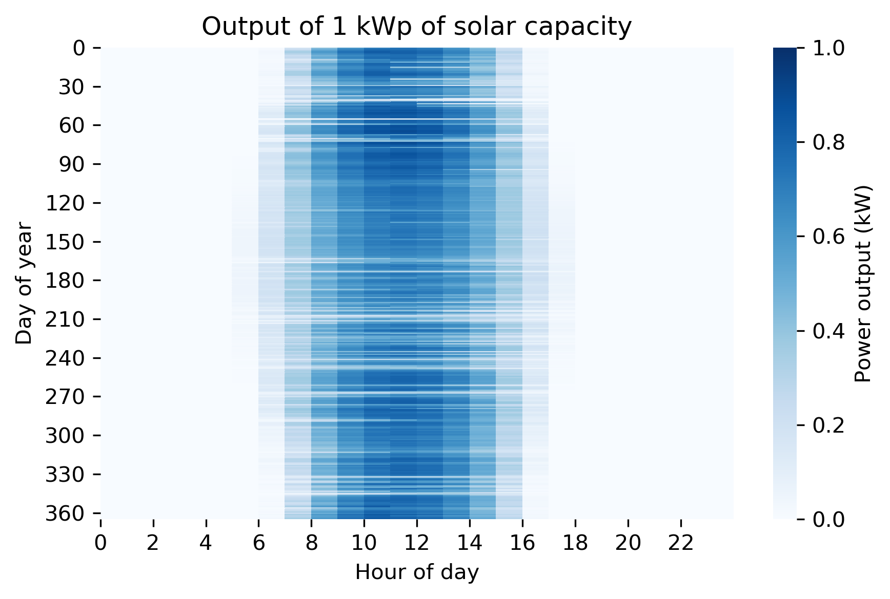

Electricity generation
======================

This section provides an overview of how to set up the electricity
generation in CLOVER using its three modules solar, diesel and the
national grid network. Further modules with new technologies could be
added in the future to increase its functionality.

Solar
-----

Preparation
~~~~~~~~~~~

The *Solar* module allows the user to get solar generation data for
their location using the *Renewables.ninja* interface. Because this
module relies on this external source of data it acts differently from
other CLOVER modules, but ultimately returns the format of data that we
expect from all of the generation files.

First, **complete the "PV generation inputs" CSV file in the PV
folder**, which itself is located in the *Generation* folder. Let’s take
a look at the inputs:

.. code:: ipython3

    import pandas as pd
    solar_inputs = pd.read_csv("/Users/prs09/Documents/CLOVER/Locations/Bahraich/Generation/PV/PV generation inputs.csv",header=None)
    solar_inputs.head(len(solar_inputs))

.. raw:: html

    

    
    <table border="1" class="dataframe">
      <thead>
        <tr style="text-align: right;">
          <th></th>
          <th>0</th>
          <th>1</th>
          <th>2</th>
        </tr>
      </thead>
      <tbody>
        <tr>
          <th>0</th>
          <td>tilt</td>
          <td>29</td>
          <td>degrees above horizontal</td>
        </tr>
        <tr>
          <th>1</th>
          <td>azim</td>
          <td>180</td>
          <td>degrees from north</td>
        </tr>
        <tr>
          <th>2</th>
          <td>lifetime</td>
          <td>20</td>
          <td>years</td>
        </tr>
      </tbody>
    </table>
    

|

These should all be straightforward: we assume our panels are
south-facing (180\ :math:`^{\circ}` from North) and has a lifetime of 20
years, typical for a solar panel and used by CLOVER to account for
module degradation. We also have stated that our panels will have a tilt
(or elevation) of 29\ :math:`^{\circ}` above the horizontal, or make a
29\ :math:`^{\circ}` angle compared to flat ground (which would be
0\ :math:`^{\circ}`). This angle could (for example) be the tilt of a
roof that the panels are assumed to be located on, or it could be the
optimum angle that maximises total energy generation over the course of
a year (which can be found using the *Renewables.ninja* web interface,
or many other programmes).

Getting solar generation
~~~~~~~~~~~~~~~~~~~~~~~~

Our goal is to get 20 years of solar generation data for our location at
an hourly resolution. The data will be the output energy of one
functional unit of nominal power of the PV for each hour of the year,
assuming it is installed at the specified location and orientation. The
functional unit of nominal power (also called the nameplate capacity) is
the kilowatt-peak (kWp), defined to be instantaneous power output of a
PV array under standard test conditions (1000 W/m\ :math:`^2`). This
value is most commonly reported when buying solar modules, for example a
panel with a nominal power (or nameplate capacity) of 300 Wp (0.3 kWp)
would provide 300 W of power when illuminated under standard test
conditions, or have a higher output if the illumination were higher (and
vice versa). The actual power received from a module of a given capacity
depends on many factors, for example the amount of illumination on the
panel and the losses from a variety of sources, but *Renewables.ninja*
calculates these automatically for us.

Using this functional unit makes it easy to scale up the generation
capacity to the desired amount in a simulated system. First, check that
you have already updated the location and filepaths of the *Solar*
module and **run the script (using the green arrow in the Spyder
console)**. Here we run it like so:

.. code:: ipython3

    import sys
    sys.path.insert(0, '/Users/prs09/Documents/CLOVER/Scripts/Generation scripts/')
    from Solar import Solar

The *Solar* module contains several nested functions which automatically
provide a step-by-step process to send data to *Renewables.ninja* about
the system parameters, account for the orientation of the system, and
return ready-to-use data. We want to get 20 years of solar data but
unfortunately the archives do not go back that far, so instead we will
get 10 years of data and repeat it: this will allow us to keep the
year-on-year variation whilst also covering our entire desired time
period.

To do this we run a function which gets one year of solar generation and
repeat the process until we have 10 years. In the Bahraich example we
have data from 2007 to 2016, so let’s replicate this. First we will
generate the data for 2007 by running the following function:

.. code:: ipython3

    Solar().save_solar_output(gen_year = 2007)

This automatically saves a CSV file for us, and we can look at the first
day’s worth of entries:

.. code:: ipython3

    solar_generation_2007 = pd.read_csv("/Users/prs09/Documents/CLOVER/Locations/Bahraich/Generation/PV/solar_generation_2007.csv",header=None)
    solar_generation_2007.columns = ['Hour','kW']
    print(solar_generation_2007[0:24])

.. parsed-literal::

        Hour     kW
    0      0  0.000
    1      1  0.000
    2      2  0.000
    3      3  0.000
    4      4  0.000
    5      5  0.000
    6      6  0.000
    7      7  0.009
    8      8  0.184
    9      9  0.419
    10    10  0.591
    11    11  0.687
    12    12  0.733
    13    13  0.697
    14    14  0.594
    15    15  0.417
    16    16  0.192
    17    17  0.017
    18    18  0.000
    19    19  0.000
    20    20  0.000
    21    21  0.000
    22    22  0.000
    23    23  0.000

As expected, we start getting solar generation from 6:00 (note that
Python begins counting from 0, so the hours of the day run from 0 to 23)
which peaks in the middle of the day and finishes by 17:00.

We then run the same function for the following nine years:

::

   Solar().save_solar_output(gen_year = 2008)
   Solar().save_solar_output(gen_year = 2009)
   ...
   Solar().save_solar_output(gen_year = 2016)

Until we have 10 years of data. Now we can compile the data together
using a function that stitches the data together in order, from the
starting year of 2007, then repeats it to give the full 20 years of
generation data:

.. code:: ipython3

    Solar().total_solar_output(start_year = 2007)

This file contains the total solar generation expected for the 1 kWp
unit panel over the course of 20 years, which is what we aimed to
achieve. This is the file that is imported in the *Energy_System* module
and used to calculate the total PV generation in a system. **Use this
process to generate solar data for your location.**

Extension and visualisation
~~~~~~~~~~~~~~~~~~~~~~~~~~~

For interest, let’s see its cumulative generation over its lifetime,
rounded to the nearest kWh:

.. code:: ipython3

    import numpy as np
    solar_generation_lifetime = pd.read_csv("/Users/prs09/Documents/CLOVER/Locations/Bahraich/Generation/PV/solar_generation_20_years.csv")
    total_generation = np.round(np.sum(solar_generation_lifetime['0.0']))
    print('Cumulative generation: ' + str(total_generation)+' kWh')
    print('Average generation: '+str(round(total_generation/(20*365)))+' kWh per day')

.. parsed-literal::

    Cumulative generation: 36655.0 kWh
    Average generation: 5.0 kWh per day

This panel is expected to produce 36.7 MWh of energy over its lifetime,
or around 5.0 kWh of energy per day - this is reasonable given the
location of the panel in a relatively sunny location in India.

We can quickly visualise its generation over the course of the first
year of its lifetime by taking the first 8760 hours (24 hours times 365
days) and plotting this as a heatmap:

.. code:: ipython3

    solar_gen_year = solar_generation_lifetime.iloc[0:8760]['0.0']
    solar_gen_year = np.reshape(solar_gen_year.values,(365,24))

    import seaborn as sns
    import matplotlib.pyplot as plt
    import matplotlib as mpl

    %matplotlib inline
    mpl.rcParams['figure.dpi'] = 300

    g = sns.heatmap(solar_gen_year,
                           vmin = 0.0, vmax = 1.0,
                           cmap = 'Blues', cbar_kws = {'label':'Power output (kW)'})
    g.set(xticks = range(0,24,2), xticklabels = range(0,24,2),
          yticks = range(0,365,30), yticklabels = range(0,365,30),
          xlabel = 'Hour of day', ylabel = 'Day of year',
          title = 'Output of 1 kWp of solar capacity')
    plt.xticks(rotation = 0)
    plt.tight_layout()
    plt.show()

As we might expect, the solar output varies throughout the year with
longer periods of generation during the summer months. Some days have
far less generation, potentially due to cloudy conditions. We can also
see the total daily generation over the course of the year by taking the
sum of the reshaped ``solar_gen_year`` object and plotting the result:

.. code:: ipython3

    solar_daily_sums = pd.DataFrame(np.sum(solar_gen_year,axis=1))
    plt.plot(range(365),solar_daily_sums)
    plt.xticks(range(0,365,30))
    plt.yticks(range(0,9,2))
    plt.xlabel('Day of year')
    plt.ylabel('Energy generation (kWh per day)')
    plt.title('Daily energy generation of 1 kWp of solar capacity')
    plt.show()

.. image:: output_15_0.png

Troubleshooting
~~~~~~~~~~~~~~~

The reason why we need to import the data from *Renewables.ninja*
manually is because the API will flag multiple repeated requests to its
servers and deny access. This makes it not possible to put the
``Solar().save_solar_output(gen_year)`` function into a for loop for
convenience, as the code will be executed faster than that which the API
will allow. This will also apply if you manually run the function too
quickly, so if you receive an error message relating to the API then
wait for around one minute and try again.

Periodically the *Renewables.ninja* changes its API settings which
affects the way that the *Solar* module interacts with the website. This
requires the CLOVER code to be updated, so if you identify this
happening please email `Philip
Sandwell <mailto:philip.sandwell@gmail.com>`__.

Grid
----

Preparation
~~~~~~~~~~~

The *Grid* module simulates the availability of the national grid
network at the location, particularly when the grid is unreliable or has
variable availability throughout the day. CLOVER assumes that when the
grid is available it can provide an unlimited amount of power to satisfy
the needs of the community for the entire hour in question or, if
unavailable, no power can be drawn from it. The goal of the *Grid*
module is to provide an hourly profile of whether the grid is available
or not by using a user-specified availability profile (or several of
them, if many are to be investigated).

First, **complete the "Grid inputs" CSV file** in the *Grid* folder,
which itself is located in the *Generation* folder. Let’s take a look at
the inputs:

.. code:: ipython3

    grid_times = pd.read_csv("/Users/prs09/Documents/CLOVER/Locations/Bahraich/Generation/Grid/Grid inputs.csv",header=0)
    print(grid_times)

.. parsed-literal::

        Name  none  all  daytime  eight_hours  bahraich
    0      0     0    1        0         0.33      0.57
    1      1     0    1        0         0.33      0.61
    2      2     0    1        0         0.33      0.54
    3      3     0    1        0         0.33      0.50
    4      4     0    1        0         0.33      0.48
    5      5     0    1        0         0.33      0.48
    6      6     0    1        0         0.33      0.46
    7      7     0    1        0         0.33      0.34
    8      8     0    1        1         0.33      0.25
    9      9     0    1        1         0.33      0.30
    10    10     0    1        1         0.33      0.35
    11    11     0    1        1         0.33      0.35
    12    12     0    1        1         0.33      0.33
    13    13     0    1        1         0.33      0.29
    14    14     0    1        1         0.33      0.32
    15    15     0    1        1         0.33      0.35
    16    16     0    1        1         0.33      0.35
    17    17     0    1        1         0.33      0.32
    18    18     0    1        0         0.33      0.39
    19    19     0    1        0         0.33      0.14
    20    20     0    1        0         0.33      0.18
    21    21     0    1        0         0.33      0.46
    22    22     0    1        0         0.33      0.47
    23    23     0    1        0         0.33      0.51

This file describes five grid availability profiles, with each of the
values corresponding to the probability that the grid will be available
in the hour of the day specified on the left. Taking the sum of those
values will give the average number of hours per day that the grid will
be available. The profiles we have here are:

* ``none`` has no grid availability at all throughout the day, equivalent to not being connected to the grid
* ``all`` has full grid availability at all times
* ``daytime`` has grid availability throughout the day (8:00 until 17:59) but never at night
* ``eight_hours`` will provide approximately eight hours of power, randomly available throughout the day
* ``bahraich`` is an example profile from data gathered from Bahraich district, where availability is higher in the early morning and late evening but lower during the daty and early evening.

You can add further grid profiles by adding additional columns in the
CSV file; they can have any name and values for grid availability must
be in the range 0-1 as they represent probabilities. Save this file before
moving on.

Getting grid availability profiles
~~~~~~~~~~~~~~~~~~~~~~~~~~~~~~~~~~

Our goal is to get 20 years of grid availability data at an hourly
resolution, represented as 0s (grid is unavailable) and 1s (grid is
available), for each of the grid profiles listed in *Grid inputs*.

First, check that you have already updated the location and filepaths of
the *Grid* module and **run the script (using the green arrow in the
Spyder console)**. Here we run it like so:

.. code:: ipython3

    from Grid import Grid

The *Grid* module is quite straightforward as it uses a single function
to take an input grid profile, repeats the probability profile over a 20
year period, uses binomial statistics to transsform them into a profile
of 0s and 1s, and save this availability as a new output CSV file to use
later. To do this for all of the grid profiles **run the following
function** in your console:

::

   Grid().get_lifetime_grid_status()

Once this function is completed your new grid profiles will appear in
your *Grid* folder and be ready to use, with their file names
corresponding to the name of the status given in the input file (e.g.
``eight_hours_grid_status.csv``). Given the nature of the calculation,
this function will take a while to complete. This is normal and
fortunately this process needs to be completed only once: the same grid
availability profiles can be used in each of your investigations for
reproducibility.

Extension and visualisation
~~~~~~~~~~~~~~~~~~~~~~~~~~~

Let’s take a closer look the ``bahraich`` grid profile by seeing how
many hours per day it is available on average:

.. code:: ipython3

    bahraich_daily_hours = np.sum(grid_times['bahraich'],axis=0)
    print(str(bahraich_daily_hours) + ' hours per day')

.. parsed-literal::

    9.34 hours per day

The ``bahraich`` profile gives an average of 9.34 hours of availability
per day, relatively normal for that region of rural India but definitely
has potential to be improved by installing a minigrid system. Now let’s
plot the grid availability throughout the day

.. code:: ipython3

    plt.plot(range(24),grid_times['bahraich'],color='k')
    plt.xticks(range(0,24,2))
    plt.yticks(np.arange(0,1.1,0.2))
    plt.xlabel('Hour of day')
    plt.ylabel('Probability')
    plt.title('Probability of grid electricity being available')
    plt.show()

.. image:: output_24_0.png

As we saw before, the grid is most likely to be available in the early
morning and least likely to be available in the evening. We can also
investigate the ``bahraich`` grid availability profile that we made
using ``Grid().get_lifetime_grid_status()``, for example by viewing
whether the grid is available or not over the first year. Here we plot
it using a colour scheme of white meaning the grid is available, or
black when it is not (i.e. a blackout):

.. code:: ipython3

    bahraich_profile = pd.read_csv("/Users/prs09/Documents/CLOVER/Locations/Bahraich/Generation/Grid/bahraich_grid_status.csv")
    bahraich_profile = bahraich_profile.iloc[0:8760]['0']
    bahraich_profile = np.reshape(bahraich_profile.values,(365,24))

    g = sns.heatmap(bahraich_profile,
                    vmin = 0.0, vmax = 1.0,
                    cmap = 'Greys_r', cbar=False)
    g.set(xticks = range(0,24,2), xticklabels = range(0,24,2),
          yticks = range(0,365,30), yticklabels = range(0,365,30),
          xlabel = 'Hour of day', ylabel = 'Day of year',
          title = 'Grid availability of the Bahraich profile')
    plt.xticks(rotation = 0)
    plt.tight_layout()
    plt.show()

.. image:: output_26_0.png

We can once again see the expected structure from the one-day
availability input profile, but now with the randomness of day-to-day
variations. There is greater availability in the mornings, but not
always, and only on a very small number of days is power available
between 19:00 and 21:00.

We can also compare the ``bahraich`` input profile to the synthesised
availability profile to make sure they match up:

.. code:: ipython3

    plt.plot(range(24),grid_times['bahraich'],color='k',label='Input')
    plt.plot(range(24),np.mean(bahraich_profile,axis=0),color='r',label='Output')
    plt.legend()
    plt.xticks(range(0,24,2))
    plt.yticks(np.arange(0,1.1,0.2))
    plt.xlabel('Hour of day')
    plt.ylabel('Probability')
    plt.title('Probability of grid electricity being available')
    plt.show()

.. image:: output_28_0.png

As we should expect, the output profile matches the input profile
closely, but not exactly, owing to the random process that was used to
generate it.

Troubleshooting
~~~~~~~~~~~~~~~

Rerunning the ``Grid().get_lifetime_grid_status()`` function will create
new profiles: these will share the same statistics as a previously
generated grid status but not be exactly the same. If you want to
generate a new grid status but also want to keep ones you have already
generated, it is recommended that you save your original files in
another location and copy them back to the *Grid* folder once your new
profile is complete.

CLOVER has the functionality to create grid profiles with variation
throughout the day, but not throughout the year. If you want to include
this, create an availability profile in a compatible format (20 years of
hourly data, composed of 0s and 1s) using some other means, name it
using the\ ``[name]_grid_status.csv`` format, and copy this CSV file to
the *Grid* folder. CLOVER should be able to use this CSV file as an
input later, the same as any others that it generates.

Diesel
------

Preparation
~~~~~~~~~~~

The *Diesel* module is a passive script, meaning that the user needs to
provide it with inputs but not actively run any of its functions (CLOVER
does this automatically instead). In the current release of CLOVER
diesel generation is treated as a backup source of power when the other
sources are unable to provide electricity, filling in periods of
blackouts after a simulation is complete to provide greater levels of
reliability. This means it can be used as a backup source of power in a
hybrid system (for example switching on automatically when renewable
generation is not sufficient) but not as dispatchable generation coming
on at user-specified times. This functionality will be included in the
next update of CLOVER.

First, **complete the "Diesel inputs" CSV file** in the *Diesel*
folder, which itself is located in the *Generation* folder. Let’s take a
look at the inputs:

.. code:: ipython3

    diesel_inputs = pd.read_csv("/Users/prs09/Documents/CLOVER/Locations/Bahraich/Generation/Diesel/Diesel inputs.csv")
    print(diesel_inputs)

.. parsed-literal::

        Diesel consumption   0.4    litres per kW capacity per hour
    0  Diesel minimum load  0.35  Minimum capacity factor (0.0-1.0)

This input file contains just two variables but more parameters
governing the usage of the diesel generator are included elsewhere.
``Diesel consumption`` refers to the hourly fuel consumption of the
generator per kW of output, for example a generator providing 10 kW
would use 4.0 litres of fuel per hour. CLOVER assumes that this fuel
consumption is constant per kW of power being supplied, although in real
systems diesel generators may have varying efficiencies dependent on the
load factor.

``Diesel minimum load`` is the lowest load factor that the generator is
permitted to operate at (for example to avoid mechanical issues or
degradation), expressed as a fraction. For example, a 5 kW generator
would be forced to provide at least 1.75 kW (5.0 kW x 0.35) of power to
ensure it runs above the minimum load factor even if the load were less
than this, with the remaining energy being dumped.

Getting diesel generation
~~~~~~~~~~~~~~~~~~~~~~~~~

As mentioned above, as a passive script CLOVER uses the *Diesel* module
automatically so the user does not need to run any of its functions.
Nevertheless it is good practice to ensure that the script runs as
expected, so check that you have already updated the location and
filepaths of the *Diesel* module and **run the script (using the green
arrow in the Spyder console)**. Here we run it like so:

.. code:: ipython3

    from Diesel import Diesel

Now the script is ready to be used by the rest of CLOVER.
