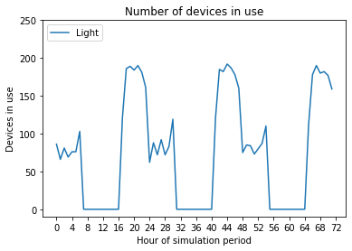
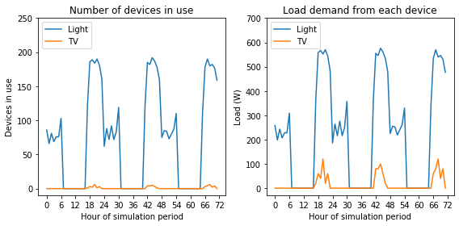
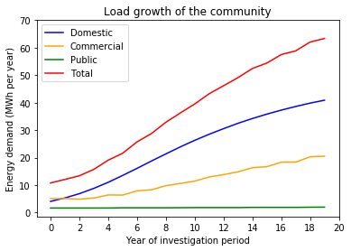

Load profiles
=============

CLOVER has the functionality to build load profiles from the bottom-up,
summarised in the following steps:

#. Input the devices or appliances available in the community
#. Input the usage profile of each device throughout the day and year
#. Calculate the number of devices in use throughout the lifetime of the system
#. Calculate the daily utilisation profile of each device
#. Calculate the number of devices in use in every hour
#. Calculate the load profile of each device
#. Calculate the total load profile of the community.

This process is performed by the *Load* module, described in this
section. The terms *device* and *appliance* are used interchangeably,
meaning any piece of equipment that uses electricity, and specific
meanings of other similar terms (for example *usage* and *utilisation*)
will be made explicit where relevant.

Preparation
-----------

Input the devices in the community
~~~~~~~~~~~~~~~~~~~~~~~~~~~~~~~~~~

CLOVER allows the user to include as many devices as desired in their
load profile. These are input using the ``Devices`` input CSV in the
*Load* folder for the given location, which can be edited directly.
Let’s look at the devices included for Bahraich:

.. code:: ipython3

    import pandas as pd
    devices = pd.read_csv("/Users/prs09/Documents/CLOVER/Locations/Bahraich/Load/Devices.csv")
    devices.head(len(devices))

.. raw:: html

    

    
    <table border="1" class="dataframe">
      <thead>
        <tr style="text-align: right;">
          <th></th>
          <th>Device</th>
          <th>Available</th>
          <th>Power</th>
          <th>Initial</th>
          <th>Final</th>
          <th>Innovation</th>
          <th>Imitation</th>
          <th>Type</th>
        </tr>
      </thead>
      <tbody>
        <tr>
          <th>0</th>
          <td>light</td>
          <td>Y</td>
          <td>3</td>
          <td>2.00</td>
          <td>4.00</td>
          <td>0.04</td>
          <td>0.50</td>
          <td>Domestic</td>
        </tr>
        <tr>
          <th>1</th>
          <td>phone</td>
          <td>Y</td>
          <td>5</td>
          <td>2.20</td>
          <td>3.00</td>
          <td>0.02</td>
          <td>0.20</td>
          <td>Domestic</td>
        </tr>
        <tr>
          <th>2</th>
          <td>radio</td>
          <td>Y</td>
          <td>10</td>
          <td>0.28</td>
          <td>0.35</td>
          <td>0.01</td>
          <td>0.20</td>
          <td>Domestic</td>
        </tr>
        <tr>
          <th>3</th>
          <td>tv</td>
          <td>Y</td>
          <td>20</td>
          <td>0.08</td>
          <td>0.90</td>
          <td>0.03</td>
          <td>0.25</td>
          <td>Domestic</td>
        </tr>
        <tr>
          <th>4</th>
          <td>laptop</td>
          <td>Y</td>
          <td>40</td>
          <td>0.01</td>
          <td>0.50</td>
          <td>0.02</td>
          <td>0.10</td>
          <td>Domestic</td>
        </tr>
        <tr>
          <th>5</th>
          <td>fridge</td>
          <td>Y</td>
          <td>50</td>
          <td>0.00</td>
          <td>0.50</td>
          <td>0.02</td>
          <td>0.20</td>
          <td>Domestic</td>
        </tr>
        <tr>
          <th>6</th>
          <td>fan</td>
          <td>Y</td>
          <td>10</td>
          <td>0.10</td>
          <td>2.00</td>
          <td>0.04</td>
          <td>0.30</td>
          <td>Domestic</td>
        </tr>
        <tr>
          <th>7</th>
          <td>kerosene</td>
          <td>Y</td>
          <td>1</td>
          <td>3.40</td>
          <td>2.00</td>
          <td>0.02</td>
          <td>0.10</td>
          <td>Domestic</td>
        </tr>
        <tr>
          <th>8</th>
          <td>mill</td>
          <td>Y</td>
          <td>750</td>
          <td>0.01</td>
          <td>0.10</td>
          <td>0.02</td>
          <td>0.20</td>
          <td>Commercial</td>
        </tr>
        <tr>
          <th>9</th>
          <td>workshop</td>
          <td>Y</td>
          <td>350</td>
          <td>0.05</td>
          <td>0.05</td>
          <td>0.02</td>
          <td>0.20</td>
          <td>Commercial</td>
        </tr>
        <tr>
          <th>10</th>
          <td>SME</td>
          <td>Y</td>
          <td>200</td>
          <td>0.05</td>
          <td>0.03</td>
          <td>0.25</td>
          <td>0.25</td>
          <td>Commercial</td>
        </tr>
        <tr>
          <th>11</th>
          <td>streetlight</td>
          <td>Y</td>
          <td>25</td>
          <td>0.20</td>
          <td>0.20</td>
          <td>0.00</td>
          <td>0.00</td>
          <td>Public</td>
        </tr>
      </tbody>
    </table>
    

|

This CSV contains many variables, some of which are more obvious than
others, summarised in the table below:

+-----------------------------------+-----------------------------------+
| Variable                          | Explanation                       |
+===================================+===================================+
| ``Device``                        | Unique name of the device         |
+-----------------------------------+-----------------------------------+
| ``Available``                     | Device is included (``Y``) or not |
|                                   | (``N``) in the community load     |
+-----------------------------------+-----------------------------------+
| ``Power``                         | Device power consumption (W)      |
+-----------------------------------+-----------------------------------+
| ``Initial``                       | Average ownership of the device   |
|                                   | per household at the start of the |
|                                   | time period                       |
+-----------------------------------+-----------------------------------+
| ``Final``                         | Average ownership of the device   |
|                                   | per household at the end of the   |
|                                   | time period                       |
+-----------------------------------+-----------------------------------+
| ``Innovation``                    | Parameter governing new           |
|                                   | households acquiring device       |
+-----------------------------------+-----------------------------------+
| ``Imitation``                     | Parameter governing households    |
|                                   | copying others                    |
+-----------------------------------+-----------------------------------+
| ``Type``                          | Classification of the device as a |
|                                   | ``Domestic``, ``Commercial`` or   |
|                                   | ``Public`` device                 |
+-----------------------------------+-----------------------------------+

Take the example of the device ``light``, which represents an LED bulb.
It is available in the load profile (``Available = Y``), has a power
rating of 3 W, and classified as a ``Domestic`` load. At the start of
the simulation period there is an average two LED bulbs per household
(``Initial = 2.00``) which, over time, increases to four bulbs per
household (``Final = 4.00``) by the end of the considered time period -
which we defined to be to 20 years in the *General Setup* section.

The two remaining variables describe how quickly the average ownership
per household increases: to generalise, ``Innovation`` describes how
likely a household is to get a new appliance based on how much they like
new things and ``Imitation`` describes how much a household is
influenced by others already having the device. These are inputs into a
model of how quickly devices diffuse throughout the community (described
in more detail later) but, simply put, the larger these numbers the
quicker households will acquire them. These should be treated almost as
qualitative measures: the values for a more desirable appliance like a
television should be higher than (for example) a radio. You can use
later outputs from the *Load* module to check that your appliance
diffusion seems viable.

If you do not want to include any demand growth over time by keeping the
number of appliances the same throughout the simulation, it is possible
to turn off this feature simply by setting the values for ``Initial``
and ``Final`` to be the same, which will negate the ``Innovation`` and
``Imitation`` parameters (for example ``streetlight`` does this). Bear
in mind that an increase in the number of households, defined when
establishing the location, will result in an increase in the number of
devices as the latter is calculated on the basis of the number of
devices *per household*.

One of the devices, ``kerosene``, is different from the others and is
the only device which *must* remain present in the *Devices* file.
CLOVER has the functionality to account for the usage of backup
non-electric lighting devices, such as kerosene lamps, which are used
during periods when electricity is unavailable. This is useful when
investigating electricity systems with less than 100% reliability, for
example. **This device is therefore necessary as an input for later
functions and must be present here, and have corresponding utilisation
profiles**, described later. If backup sources of non-electric lighting
are not relevant to your investigation, set ``Initial = 0`` and
``Final = 0`` in the *Devices* file to not consider it whilst still
allowing the other functions to operate as expected. If a different
non-electric lighting source is relevant, such as candles, complete the
input data for that source but the name must remain as ``kerosene`` in
the *Devices* file.

**With this in mind, complete the** ``Devices`` **input CSV for your
investigation.**

Input the device utilisation profiles
~~~~~~~~~~~~~~~~~~~~~~~~~~~~~~~~~~~~~

CLOVER first considers the service that appliances provide as a
necessary step in understanding the electricity demand of the community,
rather than jumping directly to the latter. This is because two devices
may provide very similar services, and the times of using those devices
may be very similar, but the electricity requirements could be very
different: LED and incandescent light bulbs, for example. By considering
the demand for the service as a first step it is possible to more easily
consider issues such as the usage of efficient, low-power devices which
are becoming more common.

The *utilisation* of a device is defined to be the probability that a
device is being used, given that it is present in the community.
Utilisation values can vary hourly (throughout the day) and monthly
(throughout the year) and must be between 0 (the device is never used in
a specific hour) to 1 (it is always used). Utilisation profiles for each
device are found in the *Device utilisation* folder in the *Load*
folder.

Every device listed in the ``Devices`` input CSV **must have a
utilisation profile associated with it** for CLOVER to calculate the
load demand correctly and be named ``[device]_times``. Even if a device
has ``Available = N`` in the *Devices* input CSV, CLOVER will still use
the utilisation profile but not eventually include the load in the final
total community demand. If you do not want to include a device at all it
is much easier to delete its entry from the *Devices* input CSV.

Each utilisation profile is a 24 x 12 matrix of utilisation values,
corresponding to the hour of the day for each month of the year. Let’s
take a look at the example of ``light``:

.. code:: ipython3

    light_utilisation = pd.read_csv("/Users/prs09/Documents/CLOVER/Locations/Bahraich/Load/Device utilisation/light_times.csv",header=None)
    print(light_utilisation)

.. parsed-literal::

          0     1     2     3     4     5     6     7     8     9     10    11
    0   0.39  0.39  0.39  0.39  0.39  0.39  0.39  0.39  0.39  0.39  0.39  0.39
    1   0.39  0.39  0.39  0.39  0.39  0.39  0.39  0.39  0.39  0.39  0.39  0.39
    2   0.39  0.39  0.39  0.39  0.39  0.39  0.39  0.39  0.39  0.39  0.39  0.39
    3   0.39  0.39  0.39  0.39  0.39  0.39  0.39  0.39  0.39  0.39  0.39  0.39
    4   0.39  0.39  0.39  0.39  0.48  0.56  0.46  0.39  0.39  0.39  0.39  0.39
    5   0.39  0.39  0.47  0.48  0.23  0.12  0.28  0.45  0.53  0.57  0.40  0.39
    6   0.58  0.48  0.22  0.00  0.00  0.00  0.00  0.00  0.00  0.05  0.37  0.53
    7   0.00  0.00  0.00  0.00  0.00  0.00  0.00  0.00  0.00  0.00  0.00  0.00
    8   0.00  0.00  0.00  0.00  0.00  0.00  0.00  0.00  0.00  0.00  0.00  0.00
    9   0.00  0.00  0.00  0.00  0.00  0.00  0.00  0.00  0.00  0.00  0.00  0.00
    10  0.00  0.00  0.00  0.00  0.00  0.00  0.00  0.00  0.00  0.00  0.00  0.00
    11  0.00  0.00  0.00  0.00  0.00  0.00  0.00  0.00  0.00  0.00  0.00  0.00
    12  0.00  0.00  0.00  0.00  0.00  0.00  0.00  0.00  0.00  0.00  0.00  0.00
    13  0.00  0.00  0.00  0.00  0.00  0.00  0.00  0.00  0.00  0.00  0.00  0.00
    14  0.00  0.00  0.00  0.00  0.00  0.00  0.00  0.00  0.00  0.00  0.00  0.00
    15  0.00  0.00  0.00  0.00  0.00  0.00  0.00  0.00  0.00  0.00  0.00  0.00
    16  0.00  0.00  0.00  0.00  0.00  0.00  0.00  0.00  0.00  0.00  0.00  0.00
    17  0.47  0.08  0.00  0.00  0.00  0.00  0.00  0.00  0.00  0.39  0.74  0.76
    18  0.93  0.93  0.54  0.51  0.23  0.03  0.00  0.26  0.79  0.93  0.93  0.93
    19  0.93  0.93  0.93  0.93  0.93  0.93  0.90  0.93  0.93  0.93  0.93  0.93
    20  0.93  0.93  0.93  0.93  0.93  0.93  0.93  0.93  0.93  0.93  0.93  0.93
    21  0.93  0.93  0.93  0.93  0.93  0.93  0.93  0.93  0.93  0.93  0.93  0.93
    22  0.88  0.88  0.88  0.88  0.88  0.88  0.88  0.88  0.88  0.88  0.88  0.88
    23  0.83  0.83  0.83  0.83  0.83  0.83  0.83  0.83  0.83  0.83  0.83  0.83

This device, representing an LED bulb from before, has a changing
utilisation profile throughout the day: it is never used during the
middle of the day (utilisation is 0.00), is very likely to be used in
the evenings (up to 0.93), and some lights in the community are likely
to be left on overnight (0.39). The utilisation of this device also
changes throughout the year: in January (month 0) the utilisation at
18:00 is 0.93, but is 0.00 in July (month 6), owing to the changing
times of sunset.

Making a representative utilisation profile will depend significantly on
the specifics of your own investigation. These could come from primary
data collection (indeed, the utilisation profile shown above did) or
from your best estimate of what the demand for service is likely to be.
Bear in mind that the probability that a device being used is an average
over the entire community, so this should represent the utilisation of
an “average” household without considering inter-household variations.
To model device utilisation as the same throughout the year, use the
same 24-value column for each of the 12 months.

**For every device you have listed in the** ``Devices`` **input CSV,
complete a corresponding utilisation profile matrix and ensure that is
is called** ``[device]_times``.

Building load profiles
----------------------

Calculating the number of devices in the community
~~~~~~~~~~~~~~~~~~~~~~~~~~~~~~~~~~~~~~~~~~~~~~~~~~

The next step is to know how many devices there are in the community at
any given time which, when combined with the utilisation profiles, will
then allow us to calculate how many are in use. This step is relatively
straightforward in that it takes information we have already input (into
the ``Devices`` CSV file) and calculates everything for us. It also
accounts for the growing number of devices in the community, if we chose
to use that.

To calculate this automatically for all of the devices listed, **run the
function**

::

   Load().number_of_devices_daily()

in the console. This will take every device listed and calculate the
number in the community on every day of our 20 year investigation
period, and save them as a CSV file in the *Device ownership* folder in
the *Load* folder with title format of ``[device]_daily_ownership.csv``.
Let’s take a look at the ``light`` device again and look at the first
and final number of devices in the community:

.. code:: ipython3

    light_ownership = pd.read_csv("/Users/prs09/Documents/CLOVER/Locations/Bahraich/Load/Device ownership/light_daily_ownership.csv")
    initial_light_ownership = int(light_ownership.iloc[0][1])
    final_light_ownership = int(light_ownership.iloc[-1][1])
    print('Initial light ownership = '+ str(initial_light_ownership))
    print('Final light ownership = ' + str(final_light_ownership))

.. parsed-literal::

    Initial light ownership = 200
    Final light ownership = 487

The final ``light`` ownership perhaps looks higher than expected, but
when we take into account how much the community has grown it makes
sense:

The slight discrepancy in the two values likely comes from the diffusion
model tending towards (but never quite reaching) the final value of
average ownership and/or rounding errors.

Calculating the daily utilisation profiles
~~~~~~~~~~~~~~~~~~~~~~~~~~~~~~~~~~~~~~~~~~

The utilisation profiles input for each device was defined by month but,
if we assigned that utilisation profile for the whole month-long period,
there would be a sharp transition between each month which would be
unrealistic. To overcome this CLOVER interpolates between the monthly
values to give a smooth transition between every day, meaning that there
are no harsh boundaries where demand suddenly changes. This process is
also performed automatically by CLOVER. **Run the following function in
the console to calculate this:**

::

   Load().get_device_daily_profile()

This function takes the (monthly) utilisation inputs and converts them
to a daily utilisation input of size 365 x 24 and saves it in the
*Device utilisation* folder in the *Load* folder using the title format
``[device]_daily_times.csv``. CLOVER assumes that the values stated in
the monthly utilisation profile apply to the middle day of each month
when interpolating to the daily scale.

As an example, let’s compare the monthly input values for January and
February against the first week of daily values for the ``light``
device:

.. code:: ipython3

    jan_feb_inputs = light_utilisation[light_utilisation.columns[0:2]]
    jan_feb_inputs.columns = ['Jan','Feb']
    print('Input values for January and February:\n')
    print(jan_feb_inputs)

    light_daily_utilisation = pd.read_csv("/Users/prs09/Documents/CLOVER/Locations/Bahraich/Load/Device utilisation/light_daily_times.csv",index_col=0)
    light_daily_utilisation = round(light_daily_utilisation.iloc[0:7],3)
    print('\nDaily varying values: \n')
    print(light_daily_utilisation.T)

.. parsed-literal::

    Input values for January and February:

         Jan   Feb
    0   0.39  0.39
    1   0.39  0.39
    2   0.39  0.39
    3   0.39  0.39
    4   0.39  0.39
    5   0.39  0.39
    6   0.58  0.48
    7   0.00  0.00
    8   0.00  0.00
    9   0.00  0.00
    10  0.00  0.00
    11  0.00  0.00
    12  0.00  0.00
    13  0.00  0.00
    14  0.00  0.00
    15  0.00  0.00
    16  0.00  0.00
    17  0.47  0.08
    18  0.93  0.93
    19  0.93  0.93
    20  0.93  0.93
    21  0.93  0.93
    22  0.88  0.88
    23  0.83  0.83

    Daily varying values:

            0      1      2      3      4      5      6
    0   0.390  0.390  0.390  0.390  0.390  0.390  0.390
    1   0.390  0.390  0.390  0.390  0.390  0.390  0.390
    2   0.390  0.390  0.390  0.390  0.390  0.390  0.390
    3   0.390  0.390  0.390  0.390  0.390  0.390  0.390
    4   0.390  0.390  0.390  0.390  0.390  0.390  0.390
    5   0.390  0.390  0.390  0.390  0.390  0.390  0.390
    6   0.555  0.557  0.559  0.560  0.562  0.564  0.566
    7   0.000  0.000  0.000  0.000  0.000  0.000  0.000
    8   0.000  0.000  0.000  0.000  0.000  0.000  0.000
    9   0.000  0.000  0.000  0.000  0.000  0.000  0.000
    10  0.000  0.000  0.000  0.000  0.000  0.000  0.000
    11  0.000  0.000  0.000  0.000  0.000  0.000  0.000
    12  0.000  0.000  0.000  0.000  0.000  0.000  0.000
    13  0.000  0.000  0.000  0.000  0.000  0.000  0.000
    14  0.000  0.000  0.000  0.000  0.000  0.000  0.000
    15  0.000  0.000  0.000  0.000  0.000  0.000  0.000
    16  0.000  0.000  0.000  0.000  0.000  0.000  0.000
    17  0.615  0.605  0.594  0.584  0.574  0.563  0.553
    18  0.930  0.930  0.930  0.930  0.930  0.930  0.930
    19  0.930  0.930  0.930  0.930  0.930  0.930  0.930
    20  0.930  0.930  0.930  0.930  0.930  0.930  0.930
    21  0.930  0.930  0.930  0.930  0.930  0.930  0.930
    22  0.880  0.880  0.880  0.880  0.880  0.880  0.880
    23  0.830  0.830  0.830  0.830  0.830  0.830  0.830

Note that the daily utilisation CSV file has a slightly different
structure (days are presented as rows) but we have transposed it here
and rounded to three decimal places for comparability and readability.
The hours where there is a difference between utilisation in January and
February (hours 6 and 17) also vary in the daily profile, whilst the
others remain the same as expected. As mentioned above, note that the
utilisation input for January is not the same as the daily utilisation
on day 0: the former is assumed to be for the middle day of the month in
January, whereas the latter is halfway between the inputs for December
and January. We can check this:

.. code:: ipython3

    december_utilisation_example = light_utilisation[light_utilisation.columns[11]][6]
    january_utilisation_example = light_utilisation[light_utilisation.columns[0]][6]
    midpoint = round((december_utilisation_example + january_utilisation_example) / 2.0,3)

    print('December utilisation at 6:00: ' + str(december_utilisation_example))
    print('January utilisation at 6:00: ' + str(january_utilisation_example))
    print('Midpoint utilisation between December and January: ' + str(midpoint))
    print('Day 0 utilisation at 6:00: ' + str(light_daily_utilisation.iloc[0][6]))

.. parsed-literal::

    December utilisation at 6:00: 0.53
    January utilisation at 6:00: 0.58
    Midpoint utilisation between December and January: 0.555
    Day 0 utilisation at 6:00: 0.555

As expected, the two values match.

Calculating the number of devices in use
~~~~~~~~~~~~~~~~~~~~~~~~~~~~~~~~~~~~~~~~

Now that we have both the number of devices in the community on a given
day, and the daily utilisation profile of each device, we can calculate
the number of devices that are in use at any given time. CLOVER does
this automatically for each type of device by using a binomial random
number generator: the number of trials is the number of devices, and the
probability is the utilisation value for that hour. To do this, **run
the following function in the console**:

::

   Load().devices_in_use_hourly()

This function will take a while to complete as it runs through each type
of device and randomly assigns the number in use over the full 20 year
period, and needs to be performed once only. The outputs are saved as
CSV files in the *Devices in use* folder in the *Load* folder, using the
title format ``[device]_in_use.csv``, so that they can be used as
consistent inputs when used by CLOVER. Note that rerunning this function
will create a new profile which will differ every time because of the
random statistics used to generate it: if you need to rerun this
function but want to keep your previous files, save a copy of them
elsewhere otherwise they will be overwritten.

Let’s consider the ``light`` device over the first three days of its
usage:

.. code:: ipython3

    import matplotlib.pyplot as plt
    import matplotlib as mpl

    light_in_use = pd.read_csv("/Users/prs09/Documents/CLOVER/Locations/Bahraich/Load/Devices in use/light_in_use.csv",index_col=0)
    light_in_use = light_in_use[0:72]

    plt.plot(range(72),light_in_use,label='Light')
    plt.legend(loc='upper left')
    plt.xticks(range(0,73,4))
    plt.yticks(range(0,251,50))
    plt.xlabel('Hour of simulation period')
    plt.ylabel('Devices in use')
    plt.title('Number of devices in use')
    plt.show()

The number of ``light`` devices in use in a given hour changes
throughout the day: as expected from the utilisation profile, some are
in use overnight, none are in use during the day, and most are in use in
the evenings. Comparing between days, the number of devices in use in a
certain hour also varies.

Calculating the load profile of each device
~~~~~~~~~~~~~~~~~~~~~~~~~~~~~~~~~~~~~~~~~~~

Now that we know the number of each device in use at any given time, and
the power rating of each from the *Device* input CSV, it is
straightforward to get the load profile of each device. **Run the
following function in the terminal:**

::

   Load().device_load_hourly()

This function uses the ``[device]_in_use.csv`` file and the power rating
to save a new CSV file in the *Device Load* folder in the *Load* folder
using the title format ``[device]_load.csv``.

Let’s now compare two devices, ``light`` and ``tv``, to see how the
number in use and load demand vary over the first three days:

.. code:: ipython3

    tv_in_use = pd.read_csv("/Users/prs09/Documents/CLOVER/Locations/Bahraich/Load/Devices in use/tv_in_use.csv",index_col=0)
    tv_in_use = tv_in_use[0:72]

    fig, ax = plt.subplots(1,2,figsize=(8,4))
    ax[0].plot(range(72),light_in_use,label='Light')
    ax[0].plot(range(72),tv_in_use,label='TV')
    ax[0].legend(loc='upper left')
    ax[0].set(xticks = (range(0,73,6)),yticks = range(0,251,50),
              xlabel = 'Hour of simulation period',
              ylabel = 'Devices in use',
              title = 'Number of devices in use')

    light_load = pd.read_csv("/Users/prs09/Documents/CLOVER/Locations/Bahraich/Load/Device load/light_load.csv",index_col=0)
    light_load = light_load[0:72]
    tv_load = pd.read_csv("/Users/prs09/Documents/CLOVER/Locations/Bahraich/Load/Device load/tv_load.csv",index_col=0)
    tv_load = tv_load[0:72]

    ax[1].plot(range(72),light_load,label='Light')
    ax[1].plot(range(72),tv_load,label='TV')
    ax[1].legend(loc='upper left')
    ax[1].set(xticks = (range(0,73,6)),yticks = range(0,701,100),
              xlabel = 'Hour of simulation period',
              ylabel = 'Load (W)',
              title = 'Load demand from each device')

    plt.tight_layout()
    plt.show()

Comparing the two devices, the usage of ``tv`` devices is limited to the
evening periods only and very few are ever in use, owing to the low
average ownership. When we compare the load demanded by each device,
``tv`` has a more significant effect, albeit still relatively small, as
the relative power rating is higher than that of ``light``.

Calculating the total load demand of the community
~~~~~~~~~~~~~~~~~~~~~~~~~~~~~~~~~~~~~~~~~~~~~~~~~~

Knowing the electricity demand of each appliance allows us to combine
these to give the total electricity demand of the entire community over
the duration of the investigation. Once again, CLOVER calculates this
automatically when you **run the following function in the console:**

::

   Load().total_load_hourly()

This function adds together all of the devices listed in the *Device*
input file that have ``Available = Y`` and creates a new CSV in the
*Device load* folder in the *Load* folder called ``total_load.csv``.
This also uses another of the input parameters from before, ``Type``, to
split the load into three categories: ``Domestic`` for households,
``Commercial`` for businesses and enterprises, and ``Public`` for
community-level electricity uses.

With this, we now have the necessary load data to input into our
simulations.

Troubleshooting
---------------

Most of the processes for generating load profile are automated but
there are ample opportunities for simple mistakes when inputting the
data which will cause errors. Solving the issues is normally simple but
finding where they appear can be much harder, so if they come up:

* Check that you have used consistent spelling and capitalisation for your devices throughout as these are case sensitive, e.g. ``radio`` and ``Radio`` will be treated as two completely different devices
* Check that your file names correspond to the correct devices and are in the correct formats, e.g. ``radio`` has a utilisation profile named ``radio_times``
* Ensure that your input variables are in the correct format, for example ``Type`` is either ``Domestic``, ``Commercial`` or ``Public``
* Ensure that your utilisation profiles are the correct size and format, and have the correct naming convention including the ``.csv`` suffix
* Ensure that your device power is input in Watts (W), not kilowatts (kW)
* Ensure that you have completed each of the steps in the correct order

Extension and visualisation
---------------------------

Using your own load profile
~~~~~~~~~~~~~~~~~~~~~~~~~~~

CLOVER gives users the functionality to construct their own load
profiles from the bottom up, but sometimes you already have a load
profile which you want to use directly without trying to recreate it
using the *Load* module. This is straightforward to do, but your own
load profile must be in the same format as the one generated by the
*Load* module. To do this:

-  Ensure that your load profile is in the correct format: at an hourly
   resolution for the duration of your simulation period, measured in
   Watts (not kilowatts), and with the ``Domestic``, ``Commercial`` and
   ``Public`` headings
-  Name your profile ``total_load.csv`` and copy it into the *Device
   load* folder in the *Load* folder of your location
-  Run the function
   ``Load().get_yearly_load_statistics('total_load.csv')`` to get the
   yearly load statistics
-  Copy ``kerosene_load.csv`` into the same folder (the values can be
   changed to zero, or the outputs ignored later, as necessary)

If you do not have ``Domestic``, ``Commercial`` and ``Public`` loads, or
they are combined into one category, it is most straightforward to
include them all together in a single headed column (e.g. ``Domestic``).
The ``kerosene_load.csv`` needs to be included for compatibility with
the later functionality, but the outputs relating to this can be ignored
or the values in that profile can be set to zero for completeness. The
``Load().get_yearly_load_statistics('total_load.csv')`` is used later in
the simulation process for sizing equipment (such as the inverters) so
must be updated from the default case study values provided.

Comparing domestic, commercial and public electricity demand
~~~~~~~~~~~~~~~~~~~~~~~~~~~~~~~~~~~~~~~~~~~~~~~~~~~~~~~~~~~~

Let’s take a look at how the three demand types compare over the first
three days of the simulation period:

.. code:: ipython3

    import numpy as np

    total_demand = pd.read_csv("/Users/prs09/Documents/CLOVER/Locations/Bahraich/Load/Device load/total_load.csv",index_col=0)
    total_demand = total_demand[0:72]

    plt.plot(range(72),total_demand['Domestic'],label='Domestic')
    plt.plot(range(72),total_demand['Commercial'],label='Commercial')
    plt.plot(range(72),total_demand['Public'],label='Public')
    plt.plot(range(72),np.sum(total_demand,axis=1),label='Total')
    plt.legend(loc='upper right')
    plt.xticks(range(0,73,4))
    plt.yticks(range(0,4501,500))
    plt.xlabel('Hour of simulation period')
    plt.ylabel('Power demand (W)')
    plt.title('Load profile of the community')
    plt.show()

.. image:: output_16_0.png

This allows us to compare the different types of demands in the
community and how they vary throughout the day:

* The ``Domestic`` demand is highest in the evening due to lighting and entertainment (such as TV) loads 
* The ``Commercial`` demand peaks in the day and has high variability caused by a smaller number of higher-power devices
* The ``Public`` demand, composed here as ``streetlight`` only, has a consistent load profile as it is modelled to operate on a timed basis

Varying demand throughout the year
~~~~~~~~~~~~~~~~~~~~~~~~~~~~~~~~~~

We can also see how these demands vary over the year by reformatting the
data into daily demands. For visibility let’s look at a five-day rolling
average, with the raw data plotted behind it:

.. code:: ipython3

    total_demand = pd.read_csv("/Users/prs09/Documents/CLOVER/Locations/Bahraich/Load/Device load/total_load.csv",index_col=0)
    total_demand = total_demand[0:8760]

    domestic_demand = 0.001 * np.sum(np.reshape(total_demand['Domestic'].values,(365,24)),axis=1)
    commercial_demand = 0.001 * np.sum(np.reshape(total_demand['Commercial'].values,(365,24)),axis=1)
    public_demand = 0.001 * np.sum(np.reshape(total_demand['Public'].values,(365,24)),axis=1)
    total_demand = 0.001 * np.sum(np.reshape(np.sum(total_demand,axis=1).values,(365,24)),axis=1)

    fig, ax = plt.subplots(1,2,figsize=(8,4))

    ax[0].plot(range(365),pd.DataFrame(domestic_demand).rolling(5).mean(),label='Domestic',color='blue')
    ax[0].plot(range(365),pd.DataFrame(commercial_demand).rolling(5).mean(),label='Commercial',color='orange')
    ax[0].plot(range(365),pd.DataFrame(public_demand).rolling(5).mean(),label='Public',color='green')
    ax[0].plot(range(365),domestic_demand,alpha=0.5,color='blue')
    ax[0].plot(range(365),commercial_demand,alpha=0.5,color='orange')
    ax[0].plot(range(365),public_demand,alpha=0.5,color='green')
    ax[0].legend(loc='best')
    ax[0].set(xticks = (range(0,366,60)),yticks = range(0,26,5),
              xlabel = 'Day of simulation period',
              ylabel = 'Load (kWh per day)',
              title = 'Energy demand of each load type')

    ax[1].plot(range(365),pd.DataFrame(total_demand).rolling(5).mean(),label='Total',color='red')
    ax[1].plot(range(365),total_demand,alpha=0.5,color='red')
    ax[1].legend(loc='best')
    ax[1].set(xticks = (range(0,366,60)),yticks = range(15,41,5),
              xlabel = 'Day of simulation period',
              ylabel = 'Load (kWh per day)',
              title = 'Total community energy demand')

    plt.tight_layout()
    plt.show()

.. image:: output_18_0.png

Note that the axes of the two subplots use the same scale but the axis
of the right plot, showing the total community demand, is shifted
upwards. ``Commercial`` demand, as before, displays the largest amount
of variation both between days and over the course of the year, in this
case because of varying agricultural demand. The ``Domestic`` demand has
relatively little day-to-day variation but there is a noticeable
decrease in the summer as lighting demand decreases. The growth in
``Domestic`` device ownership also results in the growth of the daily
load demand (comparing January and December), almost exceeding the
``Commercial`` demand. Finally the ``Public`` demand remains the same
throughout the year, as expected.

The total community demand is shown on the left. Its structure is mostly
governed by the variation in the ``Commercial`` demand, but the effect
of the ``Domestic`` demand can be seen when comparing the upwards shift
in load comparing the start and end of this year-long profile.

Growing demand over the investigation period
~~~~~~~~~~~~~~~~~~~~~~~~~~~~~~~~~~~~~~~~~~~~

We can see how load grows in the community across the investigation
period, for example to replicate how appliance ownership might grow over
time as a community develops economically. Let’s reformat the load data
into yearly totals and compare them across the 20-year period:

.. code:: ipython3

    total_demand = pd.read_csv("/Users/prs09/Documents/CLOVER/Locations/Bahraich/Load/Device load/total_load.csv",index_col=0)

    domestic_demand = 0.000001 * np.sum(np.reshape(total_demand['Domestic'].values,(20,8760)),axis=1)
    commercial_demand = 0.000001 * np.sum(np.reshape(total_demand['Commercial'].values,(20,8760)),axis=1)
    public_demand = 0.000001 * np.sum(np.reshape(total_demand['Public'].values,(20,8760)),axis=1)
    total_demand = 0.000001 * np.sum(np.reshape(np.sum(total_demand,axis=1).values,(20,8760)),axis=1)

    plt.plot(range(20),domestic_demand,label='Domestic',color='blue')
    plt.plot(range(20),commercial_demand,label='Commercial',color='orange')
    plt.plot(range(20),public_demand,label='Public',color='green')
    plt.plot(range(20),total_demand,label='Total',color='red')

    plt.legend(loc='upper left')
    plt.xticks(range(0,21,2))
    plt.yticks(range(0,71,10))
    plt.xlabel('Year of investigation period')
    plt.ylabel('Energy demand (MWh per year)')
    plt.title('Load growth of the community')
    plt.show()

We can see here that the ``Domestic`` and ``Commercial`` loads both
increase over time, but the ``Domestic`` increases much faster than
``Commercial`` and therefore is the greatest contributor to the total
load soon after the first year (as we saw in
`earlier <#varying-demand-throughout-the-year>`__). The ``Public``
demand meanwhile remains the same throughout.
