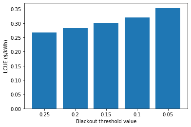
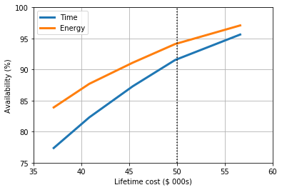

Electricity system optimisation
===============================

Preparation
-----------

Now that we can simulate an electricity system we can combine this
information with the costs and impact over its lifetime, and those of
many other system configurations, in order to select the optimum for our
chosen application and criteria. This will allow us to choose the most
suitable combination of generation and storage technologies to meet our
needs most cost effectively, for example.

Before we can do this we need to provide more information about the the
impacts of the installed system, and the conditions that we define to be
the optimum for our scenario.

Finance inputs
~~~~~~~~~~~~~~

Financial information is often the key decision metric for designing and
implementing a system: renewable energy systems can provide a number of
co-benefits, but often ultimately need to make financial sense in order
to be selected for deployment. This could be in terms of providing
electricity at a given price, for example lower than the incumbent or
some alternative option, or ensuring that the total cost of a system
does not exceed a certain budget.

The inputs for the financial impact of the system are included in the
``Finance inputs`` file, which is located in the *Impact* folder of your
location folder. Let’s take a look at the inputs for the Bahraich case
study:

.. code:: ipython3

    import pandas as pd
    finance_inputs = pd.read_csv("/Users/prs09/Documents/CLOVER/Locations/Bahraich/Impact/Finance inputs.csv",header=None)
    finance_inputs.head(len(finance_inputs))

.. raw:: html

    

    
    <table border="1" class="dataframe">
      <thead>
        <tr style="text-align: right;">
          <th></th>
          <th>0</th>
          <th>1</th>
          <th>2</th>
        </tr>
      </thead>
      <tbody>
        <tr>
          <th>0</th>
          <td>Discount rate</td>
          <td>0.100</td>
          <td>fraction</td>
        </tr>
        <tr>
          <th>1</th>
          <td>PV cost</td>
          <td>500.000</td>
          <td>$/kWp</td>
        </tr>
        <tr>
          <th>2</th>
          <td>PV O&amp;M</td>
          <td>5.000</td>
          <td>$/kWp p.a.</td>
        </tr>
        <tr>
          <th>3</th>
          <td>PV cost decrease</td>
          <td>5.000</td>
          <td>% p.a.</td>
        </tr>
        <tr>
          <th>4</th>
          <td>Storage cost</td>
          <td>400.000</td>
          <td>$/kWh</td>
        </tr>
        <tr>
          <th>5</th>
          <td>Storage O&amp;M</td>
          <td>10.000</td>
          <td>$/kWh p.a.</td>
        </tr>
        <tr>
          <th>6</th>
          <td>Storage cost decrease</td>
          <td>5.000</td>
          <td>% p.a.</td>
        </tr>
        <tr>
          <th>7</th>
          <td>Diesel generator cost</td>
          <td>200.000</td>
          <td>$/kW</td>
        </tr>
        <tr>
          <th>8</th>
          <td>Diesel generator cost decrease</td>
          <td>0.000</td>
          <td>% p.a.</td>
        </tr>
        <tr>
          <th>9</th>
          <td>Diesel fuel cost</td>
          <td>0.900</td>
          <td>$/litre</td>
        </tr>
        <tr>
          <th>10</th>
          <td>Diesel fuel cost decrease</td>
          <td>-1.000</td>
          <td>% p.a.</td>
        </tr>
        <tr>
          <th>11</th>
          <td>Diesel O&amp;M</td>
          <td>20.000</td>
          <td>$/kW p.a.</td>
        </tr>
        <tr>
          <th>12</th>
          <td>BOS cost</td>
          <td>200.000</td>
          <td>$/kW</td>
        </tr>
        <tr>
          <th>13</th>
          <td>BOS cost decrease</td>
          <td>2.000</td>
          <td>% p.a.</td>
        </tr>
        <tr>
          <th>14</th>
          <td>PV installation cost</td>
          <td>100.000</td>
          <td>$/kW</td>
        </tr>
        <tr>
          <th>15</th>
          <td>PV installation cost decrease</td>
          <td>0.000</td>
          <td>% p.a.</td>
        </tr>
        <tr>
          <th>16</th>
          <td>Diesel installation cost</td>
          <td>50.000</td>
          <td>$/kW</td>
        </tr>
        <tr>
          <th>17</th>
          <td>Diesel installation cost decrease</td>
          <td>0.000</td>
          <td>% p.a.</td>
        </tr>
        <tr>
          <th>18</th>
          <td>Connection cost</td>
          <td>100.000</td>
          <td>$/household</td>
        </tr>
        <tr>
          <th>19</th>
          <td>Kerosene cost</td>
          <td>0.008</td>
          <td>$/hour</td>
        </tr>
        <tr>
          <th>20</th>
          <td>Grid cost</td>
          <td>0.010</td>
          <td>$/kWh</td>
        </tr>
        <tr>
          <th>21</th>
          <td>Grid extension cost</td>
          <td>5000.000</td>
          <td>$/km</td>
        </tr>
        <tr>
          <th>22</th>
          <td>Grid infrastructure cost</td>
          <td>2000.000</td>
          <td>$</td>
        </tr>
        <tr>
          <th>23</th>
          <td>Inverter cost</td>
          <td>200.000</td>
          <td>$/kW</td>
        </tr>
        <tr>
          <th>24</th>
          <td>Inverter cost decrease</td>
          <td>2.000</td>
          <td>% p.a.</td>
        </tr>
        <tr>
          <th>25</th>
          <td>Inverter lifetime</td>
          <td>4.000</td>
          <td>years</td>
        </tr>
        <tr>
          <th>26</th>
          <td>Inverter size increment</td>
          <td>1.000</td>
          <td>kW</td>
        </tr>
        <tr>
          <th>27</th>
          <td>Misc. costs</td>
          <td>0.000</td>
          <td>$/kW</td>
        </tr>
        <tr>
          <th>28</th>
          <td>General O&amp;M</td>
          <td>500.000</td>
          <td>$ p.a.</td>
        </tr>
      </tbody>
    </table>
    

|

These variables describe the costs of the various elements of the energy
system and will be dependent on the specifics of your location; although
this is true for all of the input files, the costs are likely to vary
significantly between locations and can also have a relatively large
impact on the results of your optimisation. These data can be difficult
to assign specific values (for example if different suppliers have
different costs for a given component, or if lower costs are available
for purchasing larger quantities) so the general ethos should be to use
a value reflective of what is available for your location. Take care to
notice the units of each variable as using an input in the wrong units
would affect the costs significantly. The table below describes in more
detail what each variable means:

+-----------------------------------+-----------------------------------+
| Variable                          | Explanation                       |
+===================================+===================================+
| ``Discount rate``                 | The discount rate or cost of      |
|                                   | finance, expressed as a fraction  |
+-----------------------------------+-----------------------------------+
| ``PV cost``                       | Cost of PV modules in $/kWp       |
+-----------------------------------+-----------------------------------+
| ``PV O&M``                        | The annual cost of maintaining PV |
|                                   | modules in $/kWp                  |
+-----------------------------------+-----------------------------------+
| ``PV cost decrease``              | The annual cost decrease of PV    |
|                                   | modules in %                      |
+-----------------------------------+-----------------------------------+
| ``Storage cost``                  | The cost of storage in $/kWh      |
+-----------------------------------+-----------------------------------+
| ``Storage O&M``                   | The annual cost of maintaining    |
|                                   | storage in $/kWh                  |
+-----------------------------------+-----------------------------------+
| ``Storage cost decrease``         | The annual cost decrease of       |
|                                   | storage in %                      |
+-----------------------------------+-----------------------------------+
| ``Diesel generator cost``         | Cost of a diesel generator in     |
|                                   | $/kW                              |
+-----------------------------------+-----------------------------------+
| ``Diesel generator cost decrease``| The annual cost decrease of a     |
|                                   | diesel generator in  %            |
+-----------------------------------+-----------------------------------+
| ``Diesel fuel cost``              | Cost of diesel fuel in $/litre    |
+-----------------------------------+-----------------------------------+
| ``Diesel fuel cost decrease``     | The annual cost decrease of       |
|                                   | diesel fuel in %                  |
+-----------------------------------+-----------------------------------+
| ``Diesel O&M``                    | The annual cost of maintaining    |
|                                   | the diesel generator in $/kWh     |
+-----------------------------------+-----------------------------------+
| ``BOS cost``                      | Cost of balance of systems (BOS)  |
|                                   | components for PV in $/kWp        |
+-----------------------------------+-----------------------------------+
| ``BOS cost decrease``             | The annual cost decrease of BOS   |
|                                   | components in %                   |
+-----------------------------------+-----------------------------------+
| ``PV installation cost``          | Cost of installing PV modules in  |
|                                   | $/kWp                             |
+-----------------------------------+-----------------------------------+
| ``PV installation cost decrease`` | The annual cost decrease of       |
|                                   | installing PV modules in %        |
+-----------------------------------+-----------------------------------+
| ``Diesel installation cost``      | Cost of installing diesel         |
|                                   | generators in $/kW                |
+-----------------------------------+-----------------------------------+
| ``Diesel installation cost decrea | The annual cost decrease of       |
| se``                              | installing diesel generators in % |
+-----------------------------------+-----------------------------------+
| ``Connection cost``               | The cost of connecting a          |
|                                   | household to the system in $      |
+-----------------------------------+-----------------------------------+
| ``Kerosene cost``                 | The cost of using a kerosene lamp |
|                                   | for one hour in $                 |
+-----------------------------------+-----------------------------------+
| ``Grid cost``                     | The cost of grid electricity in   |
|                                   | $/kWh                             |
+-----------------------------------+-----------------------------------+
| ``Grid extension cost``           | The cost of extending the grid by |
|                                   | 1 km in $                         |
+-----------------------------------+-----------------------------------+
| ``Grid infrastructure cost``      | The cost of transformers (etc.)   |
|                                   | to connect the system to the grid |
|                                   | in $                              |
+-----------------------------------+-----------------------------------+
| ``Inverter cost``                 | Cost of an inverter in $/kW       |
+-----------------------------------+-----------------------------------+
| ``Inverter cost decrease``        | The annual cost decrease of an    |
|                                   | inverter in %                     |
+-----------------------------------+-----------------------------------+
| ``Inverter lifetime``             | The lifetime of an inverter in    |
|                                   | years                             |
+-----------------------------------+-----------------------------------+
| ``Inverter size increment``       | The variety of available sizes of |
|                                   | inverters in kW                   |
+-----------------------------------+-----------------------------------+
| ``Misc. costs``                   | General miscellaneous             |
|                                   | capacity-dependent costs for the  |
|                                   | system in $/kW                    |
+-----------------------------------+-----------------------------------+
| ``General O&M``                   | General miscellaneous annual      |
|                                   | costs for the system in $ per     |
|                                   | year                              |
+-----------------------------------+-----------------------------------+

The first variable, ``Discount rate``, describes the cost of financing
used when considering the value of money over time. This is input here
as a fraction, ``0.1``, corresponding to a discount rate of 10%. The
cost of financing can vary significantly between countries and projects
depending on many factors, such as the risk associated with the project,
and can affect the cost effectiveness of different technologies: broadly
speaking, a high discount rate will discourage large initial investment
(for example in solar and storage capacity) and favour repeated
expenditure over time (for example on diesel fuel).

The costs of solar generation, diesel and storage technologies are
treated similarly. Each has a cost associated with purchasing the
equipment and maintaining it dependent on the total capacity installed,
and an annual cost decrease representing how costs of technology can
change over time (we define these variables as a decrease, so a positive
value represents costs falling over time whilst a negative value
represents them increasing). The diesel generator has additional
variables associated with the cost of fuel, solar generation has those
for balance of system components such as frames and wiring, and both
have costs of initially installing the generation capacity; these are
all treated in a similar way.

Two variables relate directly to households in the system. The first is
``Connection cost``, which represents the cost of connecting a household
to the system; this could include wiring, electricity meters,
installation costs, or any others related to providing a household with
a connection. The second is ``Kerosene cost``, which is the cost that a
household incurs for using one kerosene lamp for one hour. This would
mainly be comprised of the cost of kerosene fuel, but could also include
a contribution to the cost of the lamp itself although this will likely
be negligible. This variable is used to calculate the spending on
kerosene by the community when electricity is unavailable.

The cost of electricity from the grid used by the system is assigned in
``Grid cost``. Additional costs associated with the national grid are
``Grid extension cost``, which represents the cost of extending the
network to the community being investigated if it is not currently
present there, and ``Grid infrastructure cost``, which is the cost of
the transformers and other equipment used to convert power from the grid
for use in the local distribution network. At present
``Grid extension cost`` is not used in the financial calculations, but
could be used in the future to calculate the breakeven distance at which
an off-grid system is more cost effective than extending the national
network.

Variables about the inverter used in the system are also included here,
with the cost and cost decrease acting similarly to those for generation
and storage capacities. In addition the lifetime of the inverter, in
years, is included to govern the points in the simulation at which the
inverter must be replaced and a new one is purchased; this is included
here as depending on the length of a simulation period and its point in
the overall lifetime of the system it may necessitate several, or no,
replacements. The ``Inverter size increment`` variable describes the
capacity of inverters that are available to be used: for example if this
variable is set to 3 kW then the system can used an inverter with a 3
kW, 6 kW, or 9 kW (and so on) capacity, with the inverter being
oversized as necessary.

Finally, ``Misc. costs`` and ``General O&M`` can be used to include any
additional miscellaneous costs that are not captured in the other
variables and that are dependent on either the capacity of the system or
are annually recurring, respectively.

If you are not using certain technologies in your investigation then it
is not necessary to provide values for all of the variables included
here. For example, if you are evaluating a solar and battery storage
system operating far from the national grid network, you do not need to
input values relating to diesel generators, fuel, or the cost of
electricity from the national grid. In this case it is best to leave the
default values in place or set them to zero, rather than delete them, to
ensure that you do not introduce any issues in the way that CLOVER reads
the CSV file.

These variables are designed to enumerate the financial inputs into
separate and easy-to-update categories, but some can be combined if
necessary if their units allows. For example, if a supplier is offering
that a complete solar system can be installed for a given price, this
can be captured in ``PV cost`` on its own rather than also trying to
assign values to ``BOS cost`` and ``PV installation cost`` (which here
could be set to zero as they are included in ``PV cost``). Likewise if
the system is maintained by a single operator, and is not dependent on
the capacity that has been installed, it may make more sense to include
their salary in ``General O&M`` and set ``PV O&M`` (etc.) to be zero;
this method would not consider other capacity-dependent costs however,
such as minor replacement parts.

**Complete the** ``Finance inputs`` **CSV file with the financial
information for your investigation.**

Environmental inputs
~~~~~~~~~~~~~~~~~~~~

CLOVER allows users to analyse the environmental impact of their systems
to explore the potential benefits of low-carbon energy technologies. At
present these are considered using the greenhouse gas (GHG) emissions of
the various technologies both in terms of embedded GHGs from their
manufacture and the impact over their lifetimes, for example through the
carbon intensity of the electricity they provide. These can be compared
to alternatives, such as the carbon intensity of the national grid
network, to advocate for cleaner sources of power.

The inputs for the environmental impact of the system are included in
the ``GHG inputs`` file, which is located in the *Impact* folder of your
location folder. Let’s take a look at the inputs for the Bahraich case
study:

.. code:: ipython3

    GHG_inputs = pd.read_csv("/Users/prs09/Documents/CLOVER/Locations/Bahraich/Impact/GHG inputs.csv",header=None)
    GHG_inputs.head(len(GHG_inputs))

.. raw:: html

    

    
    <table border="1" class="dataframe">
      <thead>
        <tr style="text-align: right;">
          <th></th>
          <th>0</th>
          <th>1</th>
          <th>2</th>
        </tr>
      </thead>
      <tbody>
        <tr>
          <th>0</th>
          <td>PV GHGs</td>
          <td>3000.000</td>
          <td>kgCO2/kWp</td>
        </tr>
        <tr>
          <th>1</th>
          <td>PV O&amp;M GHGs</td>
          <td>5.000</td>
          <td>kgCO2/kWp p.a.</td>
        </tr>
        <tr>
          <th>2</th>
          <td>PV GHG decrease</td>
          <td>5.000</td>
          <td>% p.a.</td>
        </tr>
        <tr>
          <th>3</th>
          <td>Storage GHGs</td>
          <td>110.000</td>
          <td>kgCO2/kWh</td>
        </tr>
        <tr>
          <th>4</th>
          <td>Storage O&amp;M GHGs</td>
          <td>5.000</td>
          <td>kgCO2/kWh p.a.</td>
        </tr>
        <tr>
          <th>5</th>
          <td>Storage GHG decrease</td>
          <td>5.000</td>
          <td>% p.a.</td>
        </tr>
        <tr>
          <th>6</th>
          <td>Diesel generator GHGs</td>
          <td>2000.000</td>
          <td>kgCO2/kW</td>
        </tr>
        <tr>
          <th>7</th>
          <td>Diesel generator GHG decrease</td>
          <td>0.000</td>
          <td>% p.a.</td>
        </tr>
        <tr>
          <th>8</th>
          <td>Diesel fuel GHGs</td>
          <td>2.000</td>
          <td>kgCO2/litre</td>
        </tr>
        <tr>
          <th>9</th>
          <td>Diesel O&amp;M GHGs</td>
          <td>10.000</td>
          <td>kgCO2/kW p.a.</td>
        </tr>
        <tr>
          <th>10</th>
          <td>BOS GHGs</td>
          <td>200.000</td>
          <td>kgCO2/kW</td>
        </tr>
        <tr>
          <th>11</th>
          <td>BOS GHG decrease</td>
          <td>2.000</td>
          <td>% p.a.</td>
        </tr>
        <tr>
          <th>12</th>
          <td>PV installation GHGs</td>
          <td>50.000</td>
          <td>kgCO2/kW</td>
        </tr>
        <tr>
          <th>13</th>
          <td>PV installation GHG decrease</td>
          <td>0.000</td>
          <td>% p.a.</td>
        </tr>
        <tr>
          <th>14</th>
          <td>Diesel installation GHGs</td>
          <td>50.000</td>
          <td>kgCO2/kW</td>
        </tr>
        <tr>
          <th>15</th>
          <td>Diesel installation GHG decrease</td>
          <td>0.000</td>
          <td>% p.a.</td>
        </tr>
        <tr>
          <th>16</th>
          <td>Connection GHGs</td>
          <td>10.000</td>
          <td>kgCO2/household</td>
        </tr>
        <tr>
          <th>17</th>
          <td>Kerosene GHGs</td>
          <td>0.055</td>
          <td>kgCO2/hour</td>
        </tr>
        <tr>
          <th>18</th>
          <td>Grid GHGs (initial)</td>
          <td>0.800</td>
          <td>kgCO2/kWh</td>
        </tr>
        <tr>
          <th>19</th>
          <td>Grid GHGs (final)</td>
          <td>0.400</td>
          <td>kgCO2/kWh</td>
        </tr>
        <tr>
          <th>20</th>
          <td>Grid extension GHGs</td>
          <td>290000.000</td>
          <td>kgCO2/km</td>
        </tr>
        <tr>
          <th>21</th>
          <td>Grid infrastructure GHGs</td>
          <td>1200000.000</td>
          <td>kgCO2</td>
        </tr>
        <tr>
          <th>22</th>
          <td>Inverter GHGs</td>
          <td>75.000</td>
          <td>kgCO2/kW</td>
        </tr>
        <tr>
          <th>23</th>
          <td>Inverter GHG decrease</td>
          <td>2.000</td>
          <td>% p.a.</td>
        </tr>
        <tr>
          <th>24</th>
          <td>Inverter lifetime</td>
          <td>4.000</td>
          <td>years</td>
        </tr>
        <tr>
          <th>25</th>
          <td>Inverter size increment</td>
          <td>1.000</td>
          <td>kW</td>
        </tr>
        <tr>
          <th>26</th>
          <td>Misc. GHGs</td>
          <td>0.000</td>
          <td>kgCO2/kW</td>
        </tr>
        <tr>
          <th>27</th>
          <td>General O&amp;M GHGs</td>
          <td>200.000</td>
          <td>kgCO2 p.a.</td>
        </tr>
      </tbody>
    </table>
    

|

Similarly to the financial inputs, the environmental inputs consider the
initial impact of installing the technologies (the embedded GHG
emissions from their manufacture) and the impact of maintaining them, as
well as the potential for technologies to decrease their impact over
time as manufacturing becomes more efficient, for example. These data
are typically much more difficult to identify values for as the
environmental impact is rarely considered in such detail, if at all, as
a secondary metric to the financial impact. As a result it may be better
to either use the default values provided or set them to zero to
disregard them depending on the nature of your investigation; either may
be appropriate, as long as the decision is acknowledged and justified
where necessary. The table below describes in more detail what each
variable means:

+-----------------------------------+-----------------------------------+
| Variable                          | Explanation                       |
+===================================+===================================+
| ``PV GHGs``                       | GHGs of PV modules in kgCO2/kWp   |
+-----------------------------------+-----------------------------------+
| ``PV O&M GHGs``                   | The annual cost of maintaining PV |
|                                   | modules in kgCO2/kWp              |
+-----------------------------------+-----------------------------------+
| ``PV GHGs decrease``              | The annual GHG decrease of PV     |
|                                   | modules in %                      |
+-----------------------------------+-----------------------------------+
| ``Storage GHGs``                  | The GHGs of storage in kgCO2/kWh  |
+-----------------------------------+-----------------------------------+
| ``Storage O&M GHGs``              | The annual GHGs of maintaining    |
|                                   | storage in kgCO2/kWh              |
+-----------------------------------+-----------------------------------+
| ``Storage GHGs decrease``         | The annual GHG decrease of        |
|                                   | storage in %                      |
+-----------------------------------+-----------------------------------+
| ``Diesel generator GHGs``         | GHGs of a diesel generator in     |
|                                   | kgCO2/kW                          |
+-----------------------------------+-----------------------------------+
| ``Diesel generator GHG decrease`` | The annual GHG decrease of a      |
|                                   | diesel generator in %             |
+-----------------------------------+-----------------------------------+
| ``Diesel fuel GHGs``              | GHGs of diesel fuel in            |
|                                   | kgCO2/litre                       |
+-----------------------------------+-----------------------------------+
| ``Diesel O&M GHGs``               | The annual GHGs of maintaining    |
|                                   | the diesel generator in kgCO2/kWh |
+-----------------------------------+-----------------------------------+
| ``BOS GHGs``                      | GHGs of balance of systems (BOS)  |
|                                   | components for PV in kgCO2/kWp    |
+-----------------------------------+-----------------------------------+
| ``BOS GHGs decrease``             | The annual GHG decrease of BOS    |
|                                   | components in %                   |
+-----------------------------------+-----------------------------------+
| ``PV installation GHGs``          | GHGs of installing PV modules in  |
|                                   | kgCO2/kWp                         |
+-----------------------------------+-----------------------------------+
| ``PV installation GHGs decrease`` | The annual GHG decrease of        |
|                                   | installing PV modules in %        |
+-----------------------------------+-----------------------------------+
| ``Diesel installation GHGs``      | GHGs of installing diesel         |
|                                   | generators in kgCO2/kW            |
+-----------------------------------+-----------------------------------+
| ``Diesel installation GHGs decrea | The annual GHGs decrease of       |
| se``                              | installing diesel generators in % |
+-----------------------------------+-----------------------------------+
| ``Connection GHGs``               | The GHGs of connecting a          |
|                                   | household to the system in kgCO2  |
+-----------------------------------+-----------------------------------+
| ``Kerosene GHGs``                 | The GHGs of using a kerosene lamp |
|                                   | for one hour in kgCO2             |
+-----------------------------------+-----------------------------------+
| ``Grid GHGs (initial)``           | The GHGs of grid electricity at   |
|                                   | the start of the time period in   |
|                                   | kgCO2/kWh                         |
+-----------------------------------+-----------------------------------+
| ``Grid GHGs (final)``             | The GHGs of grid electricity at   |
|                                   | the end of the time period in     |
|                                   | kgCO2/kWh                         |
+-----------------------------------+-----------------------------------+
| ``Grid extension GHGs``           | The GHGs of extending the grid by |
|                                   | 1 km in kgCO2                     |
+-----------------------------------+-----------------------------------+
| ``Grid infrastructure GHGs``      | The GHGs of transformers (etc.)   |
|                                   | to connect the system to the grid |
|                                   | in kgCO2                          |
+-----------------------------------+-----------------------------------+
| ``Inverter GHGs``                 | GHGs of an inverter in kgCO2/kW   |
+-----------------------------------+-----------------------------------+
| ``Inverter GHGs decrease``        | The annual GHG decrease of an     |
|                                   | inverter in %                     |
+-----------------------------------+-----------------------------------+
| ``Inverter lifetime``             | The lifetime of an inverter in    |
|                                   | years                             |
+-----------------------------------+-----------------------------------+
| ``Inverter size increment``       | The variety of available sizes of |
|                                   | inverters in kW                   |
+-----------------------------------+-----------------------------------+
| ``Misc. GHGs``                    | General miscellaneous             |
|                                   | capacity-dependent GHGs for the   |
|                                   | system in kgCO2/kW                |
+-----------------------------------+-----------------------------------+
| ``General O&M GHGs``              | General miscellaneous annual GHGs |
|                                   | for the system in kgCO2 per year  |
+-----------------------------------+-----------------------------------+

Almost all of the variables in the above table are environmental
analogues to those in the financial inputs and therefore their
descriptions will not be repeated here. The exceptions to this are
``Grid GHGs (initial)`` and ``Grid GHGs (final)``, which describe the
emissions intensity of the grid network at the start and end of the
considered lifetime of the system respectively. These allow the user to
take into account how the electricity grid might be decarbonised over
time in line with national policy objectives, which would have a
subsequent impact on the GHGs of a system using grid electricity
throughout its lifetime.

In general many of the technologies have relatively carbon-intensive
manufacturing processes, such as processing silicon for solar panels and
smelting metals for balance of systems components and wiring, whilst
diesel fuel has notoriously high emissions from its usage. Emissions
associated with operation and maintenance could come from the
maintenance itself (for example replacement parts) or other
considerations, such as the GHGs of a worker travelling to the site; in
practice, however, these O&M emissions are usually dwarfed by the
embedded emissions of equipment and those from diesel fuel and the
national grid. Emissions from transporting equipment are not explicitly
included but can be implicitly included by adding them to the
appropriate variables, for example setting ``PV GHGs`` to a value
including both the emissions from manufacturing a panel and from
shipping it to the installation site (both in terms of capacity, here
kgCO2/kWp).

**Complete the** ``GHG inputs`` **CSV file with the financial information
for your investigation.**

Optimisation inputs
~~~~~~~~~~~~~~~~~~~

The optimisation process in CLOVER is mostly automatic but in order for
it to work we need to state the conditions under which it should
operate. CLOVER performs a large number of system simulations, each with
different combinations of generation and storage capacity sizes, and
appraises them based on their technical, financial and environmental
performances; depending on our interests, any of them might be
considered “the best”. For this reason we need to provide CLOVER with
some details about what we consider to be the “optimum” system using two
variables that we define:

* The *threshold criterion*, which determines whether a simulated system meets the standards required to be considered as a potential optimum system, and
* The *optimisation criterion*, which determines which of the potential systems is selected to be the best.

Simply put, the threshold criterion decides whether a system meets our
stated needs and, as many systems are likely to be able to meet our
needs, the optimisation criterion selects the one that performs the best
according to its financial or environmental impact. As an example,
consider that we want to design a system which provides electricity 95%
of the time or more: clearly many systems will be able to do that, some
much larger than would be affordable, so we decide that the one which
provides the lowest cost of electricity would be best. Here we would
define the threshold criterion to be ``Blackouts`` (from
earlier set to a value of ``0.05`` (i.e. a
maximum of 5% blackouts), whilst the optimisation criterion would be the
levelised cost of used electricity in $/kWh (LCUE, explained further
later) with the lowest being the best. CLOVER would then identify a
system which meets those two criteria, and give us a range of other
impact metrics as well.

We also need to provide information about scenario we are investigating:
optimising over different time periods will potentially provide
different results as resource generation, load demands, technological
performance and degradation all change over time. CLOVER uses a
step-by-step optimisation process which divides the total investigation
lifetime into shorter time periods; this allows us to replicate the
process of designing a system to meet some future needs, then revisiting
the system after a few years to upgrade it as necessary to meet a
growing demand or maintain its performance. This also allows us to
consider that additional capacity in the context of what has already
been installed, adding only what is necessary rather than overhauling
the existing equipment.

The inputs for the optimisation parameters are included in the
``Optimisation inputs`` file, which is located in the *Optimisation*
folder of your location folder. Let’s take a look at the inputs for the
Bahraich case study:

.. code:: ipython3

    optimisation_inputs = pd.read_csv("/Users/prs09/Documents/CLOVER/Locations/Bahraich/Optimisation/Optimisation inputs.csv",header=None)
    optimisation_inputs.head(len(optimisation_inputs))

.. raw:: html

    

    
    <table border="1" class="dataframe">
      <thead>
        <tr style="text-align: right;">
          <th></th>
          <th>0</th>
          <th>1</th>
          <th>2</th>
          <th>3</th>
        </tr>
      </thead>
      <tbody>
        <tr>
          <th>0</th>
          <td>Scenario length</td>
          <td>12</td>
          <td>years</td>
          <td>NaN</td>
        </tr>
        <tr>
          <th>1</th>
          <td>Iteration length</td>
          <td>4</td>
          <td>years</td>
          <td>NaN</td>
        </tr>
        <tr>
          <th>2</th>
          <td>PV size (min)</td>
          <td>0</td>
          <td>kWp</td>
          <td>NaN</td>
        </tr>
        <tr>
          <th>3</th>
          <td>PV size (max)</td>
          <td>1</td>
          <td>kWp</td>
          <td>NaN</td>
        </tr>
        <tr>
          <th>4</th>
          <td>PV size (step)</td>
          <td>5</td>
          <td>kWp</td>
          <td>NaN</td>
        </tr>
        <tr>
          <th>5</th>
          <td>PV size (increase)</td>
          <td>0</td>
          <td>kWp</td>
          <td>Set to 0 to ignore</td>
        </tr>
        <tr>
          <th>6</th>
          <td>Storage size (min)</td>
          <td>0</td>
          <td>kWh</td>
          <td>NaN</td>
        </tr>
        <tr>
          <th>7</th>
          <td>Storage size (max)</td>
          <td>1</td>
          <td>kWh</td>
          <td>NaN</td>
        </tr>
        <tr>
          <th>8</th>
          <td>Storage size (step)</td>
          <td>5</td>
          <td>kWh</td>
          <td>NaN</td>
        </tr>
        <tr>
          <th>9</th>
          <td>Storage size (increase)</td>
          <td>0</td>
          <td>kWh</td>
          <td>Set to 0 to ignore</td>
        </tr>
        <tr>
          <th>10</th>
          <td>Threshold criterion</td>
          <td>Blackouts</td>
          <td>Name of column from appraisal</td>
          <td>NaN</td>
        </tr>
        <tr>
          <th>11</th>
          <td>Threshold value</td>
          <td>0.05</td>
          <td>Max/min value permitted (see guidance)</td>
          <td>NaN</td>
        </tr>
        <tr>
          <th>12</th>
          <td>Optimisation criterion</td>
          <td>LCUE ($/kWh)</td>
          <td>Name of column from appraisal</td>
          <td>NaN</td>
        </tr>
      </tbody>
    </table>
    

|

Some of the variables included in the ``Optimisation inputs`` CSV file
are not used by the current optimisation function. These were left over
from previous processes which have since been improved to increase the
speed and efficiency of the overall optimisation. These previous
functions (and their input variables) are *deprecated*, meaning that
they are not used by the standard processes in the model but are still
present in dormant sections of the code and can be used if specifically
desired by the user. For clarity, these functions are not covered in
this document but their variables are still included in the
``Optimisation inputs`` CSV file for completeness.

The table below describes in more detail what each variable means:

+-----------------------------------+-----------------------------------+
| Variable                          | Explanation                       |
+===================================+===================================+
| ``Scenario length``               | Total length of the investigation |
|                                   | period in years                   |
+-----------------------------------+-----------------------------------+
| ``Iteration length``              | Length of each step-by-step time  |
|                                   | period in years                   |
+-----------------------------------+-----------------------------------+
| ``PV size (min)``                 | Minimum size of PV capacity to be |
|                                   | considered in kWp                 |
+-----------------------------------+-----------------------------------+
| ``PV size (max)``                 | *Deprecated*                      |
+-----------------------------------+-----------------------------------+
| ``PV size (step)``                | Optimisation resolution for PV    |
|                                   | size in kWp                       |
+-----------------------------------+-----------------------------------+
| ``PV size (increase)``            | *Deprecated*                      |
+-----------------------------------+-----------------------------------+
| ``Storage size (min)``            | Minimum size of storage capacity  |
|                                   | to be considered in kWh           |
+-----------------------------------+-----------------------------------+
| ``Storage size (max)``            | *Deprecated*                      |
+-----------------------------------+-----------------------------------+
| ``Storage size (step)``           | Optimisation resolution for       |
|                                   | storage size in kWh               |
+-----------------------------------+-----------------------------------+
| ``Storage size (increase)``       | *Deprecated*                      |
+-----------------------------------+-----------------------------------+
| ``Threshold criterion``           | Criterion for identifying         |
|                                   | sufficient systems                |
+-----------------------------------+-----------------------------------+
| ``Threshold value``               | Value required for a system to be |
|                                   | considered sufficient             |
+-----------------------------------+-----------------------------------+
| ``Optimisation criterion``        | Criterion for identifying optimum |
|                                   | system                            |
+-----------------------------------+-----------------------------------+

Two variables control the length of the investigation period and that of
each of the sub-periods, with the total ``Scenario length`` comprised of
several ``Iteration length``. For example, setting
``Scenario length = 12`` and ``Iteration length = 4`` would mean that
there would be three distinct periods: the first considering the first
four years, the second considering the next four years (including the
performance of the system that was already installed for the period
before), and the third considering the last set of four years (again
including the periods before). ``Scenario length`` must be a multiple of
``Iteration length`` for the optimisation process to work, and
``Scenario length`` can be any length up to the total investigation
lifetime we defined in defined earlier to be 20 years.

The optimisation process in CLOVER first considers a system with the
smallest generation and storage capacity and gradually increases it
until it finds one that meets the threshold criterion. The first system
it considers at the start of the investigation period, with the smallest
installed capacity, is defined by ``PV size (min)`` and
``Storage size (min)``. These variables identify the starting point of
the optimisation which, for many, would be no installed capacity at all
- meaning ``PV size (min) = 0`` and ``Storage size (min) = 0``. If there
is already a system in place then set these variables to the capacity of
that system. When CLOVER moves on to the second (or later) iterations
during the optimisation process it automatically considers the capacity
that was installed during the previous time period.

The optimisation function requires the user to define the resolution of
the investigation, defined through the variables ``PV size (step)`` and
``Storage size (step)`` respectively: once CLOVER has investigated a
system it then analyses one with a larger capacity, with the increase in
capacity of the next system defined by these two variables. For example,
with ``PV size (step) = 1`` CLOVER would consider systems with
``PV size = 0, 1, 2, 3, ...`` whereas ``PV size (step) = 5`` would
consider ``PV size = 0, 5, 10, 15, ...``, with the same logic being true
for ``Storage size (step)``. Both variables can be set to different
values, and can be non-integers. For an investigation of a theoretical
system then choosing a round number for the step size might be more
convenient, but for a real investigation it could be better to use the
real available capacity of the equipment being installed. For example,
if you know that the system will be build using solar panels with a
capacity of 350 Wp, you could choose to use ``PV size (step) = 0.35``.

``Threshold criterion`` is the name of the variable being used to decide
whether a system provides sufficient performance to be considered as a
potential optimum system, as described earlier, with ``Threshold value``
being the value it must meet. The choices for ``Threshold criterion``
are described later in described later and
CLOVER knows automatically whether the ``Threshold value`` should be
considered as a maximum or minimum value: for example, if
``Threshold criterion = Blackouts`` then CLOVER interprets
``Threshold value = 0.05`` as systems are permitted to have blackout
periods for a maximum of 5% of the time. ``Optimisation criterion``,
meanwhile, is the variable being used to select the optimum system and
CLOVER similarly knows whether this should be interpreted as a maximum
or minimum: for example, ``Optimisation criterion = LCUE ($/kWh)`` would
be used to find the lowest cost of electricity. Take care that the
inputs for ``Threshold criterion`` and ``Optimisation criterion`` are
spelled correctly, otherwise the optimisation process will not work.

Considerations
~~~~~~~~~~~~~~

CLOVER can take a number of variables as either the threshold or
optimisation criteria and these should be chosen to best reflect the
context of the investigation and its goals. Typically the threshold
criterion relates to the technological performance of the system on the
basis that, in order for a system to be viable, it needs to be able to
provide a minimum level of service to the community which is (almost
always) based on its core technical functionality, rather than economic
or environmental factors. The level of service availability, either in
terms of the time energy is (un)available or the proportion of demanded
that should be met, are the most commonly used threshold criteria.
Selecting an appropriate threshold value will vary depending on the
situation, for example a system for basic domestic applications could
permit blackouts 5-10% of the time whilst one for a hospital may need 0%
system downtime.

The optimisation criterion, meanwhile, is typically a measure of the
system impact either in financial or environmental terms. Most commonly
this is the levelised cost of used electricity (LCUE, measured in
$/kWh), which considers the cost of power over the lifetime of the
system and is normally most relevant to system designers, but could also
be other financial metrics such as the total system cost which may be
more relevant to donor-led projects. Environmental analogues of these
metrics, such as the emissions intensity of electricity or the
cumulative GHG emissions, may be more relevant for projects driven by
climate change objectives.

Whilst a single criterion must be selected for use in the optimisation
process, as we will see in we will see later
the optimisation process gives us all of the available outputs and so we
can investigate all of them for an optimum system configuration. Using
different optimisation criteria may yield different results but often
the optimum systems will be relatively similar: for a given level of
service availability, it is likely that the capacity of a system
optimised for lowest cost of electricity will be similar to one
optimised for lowest cumulative cost, but may not be identical.

Choosing the resolution of an optimisation is a trade-off between
precision and computation time. Taking the above example of 1 kWp or 5
kWp resolutions, the former method would be more likely to suggest a
system closer to the true optimum: for example, if the true optimum
system (if it were possible to know it exactly) has ``PV size = 7`` then
the former method would be able to find it, but the latter method would
suggest either ``PV size = 5`` or ``PV size = 10``, depending on how the
other aspects of system influence this. Even if the true optimum system
is actually ``PV size = 7.2``, the former method still gets closer.

The importance of a precise answer will depend on the requirements of
your investigation, the size of the system, your available processing
power and your patience, so there is no exact answer for the “best” step
sizes to use. In general, it is good practice to run an initial
optimisation with a low resolution (e.g. ``PV size = 10``) to get an
idea of the order of magnitude of the system: if the optimum output for
this trial run is ``PV size = 20``, it would be appropriate to re-run
the optimisation with a higher resolution (e.g. step sizes of 1 kWp or 5
kWp) to gain greater precision. If the output is ``PV size = 300``, it
might be better to increase the step size (e.g. to 20 kWp) to reduce
computational time.

The optimisation process CLOVER uses provides the optimum system for the
iteration period under consideration, which is not necessarily the same
as one for the entire lifetime of the system. This is to replicate
real-life system design and the timeframes of community energy projects,
where plans are built around time horizons of a few years owing to
practical constraints such as funding, the limits of demand prediction,
or the likelihood of altering the business model. This also matches a
reasonable timeframe of making major upgrades to the system, for example
returning to the site every few years to perform capacity upgrades to
meet a growing demand. As such CLOVER identifies the optimum system for
the next short-term time window, providing the system that best meets
the requirements for the next stage of design, before moving on to the
next stage in time. This allows users to know the optimum system for the
immediate future and what subsequent system upgrades might look like to
maintain that optimum performance. As will all predictions the further
into the future you consider the greater uncertainty there is, but
remember that you can always return in a few years’ time to re-run your
optimisation when it’s time to upgrade your system.

As a result the of the precision of your system, the CLOVER optimisation
process might suggest different pathways of capacity sizing over the
lifetime of the system. In the example above, if a system requires
``PV size = 7.2`` in its first period and ``PV size = 12.1`` in its
second then using a ``PV size (step)`` of 1 kWp would probably give
``PV size = 7`` and ``PV size = 12``, but using a step size of 10 kWp
might give ``PV size = 10`` for both periods. The latter case might have
evaluated the relative costs and benefits of increasing the capacity to
``PV size = 20`` and found that (for example) increasing the storage
capacity instead was more worthwhile. The precision we chose has
therefore locked the two optimisations into different pathways, one with
a larger PV capacity and one with a larger storage capacity; both will
provide the same level of service (as the threshold criteria are the
same in both cases) but the optimisation impacts such as the costs will
be different. In some cases this effect can be exacerbated over several
time periods, but in general the most effective way to mitigate this is
through using higher precision in your optimisations to stay as close as
possible to the true optimum system.

**Complete the** ``Optimisation inputs`` **CSV file with the optimisation
information for your investigation.**

Performing an optimisation of an energy system
----------------------------------------------

Preparation
~~~~~~~~~~~

We are now able to perform an optimisation of an energy system using the
Optimisation module. This relies on all of the information we have input
and generated previously in the electricity system simulation section and
the earlier parts of this section. This will let us identify the optimum
system, find its solar and battery capacity, and get information about
its technological performance and its financial and environmental
impacts.

To perform an optimisation we must first **run the Optimisation script
(using the green arrow in the Spyder console)**, which we do here using
the following:

.. code:: ipython3

    import sys
    sys.path.insert(0, '/Users/prs09/Documents/CLOVER/Scripts/Optimisation scripts/')
    from Optimisation import Optimisation

The optimisation function we will use does not take any arguments from
the console as they are all included in the previous CSV files. We can
override them in the function but this is generally for specific
applications which are not relevant here.

Running an optimisation
~~~~~~~~~~~~~~~~~~~~~~~

To run an optimisation we **run the following function in the console**,
saving the output as a variable called ``example_optimisation`` so we
can look at the outputs in more detail:

::

   example_optimisation = Optimisation().multiple_optimisation_step()

This will run the optimisation function, which automatically simulates a
variety of systems with different capacity sizes until it finds the
optimum configuration. **The optimisation process can take a long time
to complete**, ranging from minutes to hours depending on your scenario
and available computing resources (hence the advice to begin at a
relatively low resolution to get an idea of the expected system size).
If you need to cancel the optimisation function before it completes,
click on the console and press ``Ctrl + C`` on your keyboard.

Whilst the optimisation function runs it outputs some information to the
screen to update on its progress. An example is below:

::

   Step 1 of 3

   Time taken for simulation: 0.16 seconds per year

   Current system: Blackouts = 0.1, Target = 0.05

In this case, the function is considering the first four-year period in
the twelve-year lifetime (``Step 1 of 3``). As before when running a
simulation, it prints information about the speed at which the
simulations are being performed. Finally it presents some information
about the performance of the system it just simulated in terms of the
chosen threshold criterion (``Blackouts = 0.1``) and the desired target
set by the ``Optimisation inputs`` CSV file (``Target = 0.05``).

In this case, we can notice that all of the systems have
``Blackouts = 0.1`` or lower, even for the very first system that is
simulated which has ``PV_size = 0`` and ``storage_size = 0``. This is
because the ``Diesel backup = Y`` and ``Diesel backup threshold = 0.1``
(from earlier) which means that the diesel
generator is activated to provide ``Blackouts = 0.1`` at the very least.
Because we set the threshold criterion higher than this, the system is
unable to use diesel alone to meet the requirements thereby forcing it
to install some renewable capacity to reach ``Blackouts = 0.05``. We
could have set ``Diesel backup threshold = 0.05`` to potentially allow
the use of diesel generation to meet our target, but in our case this
results in a diesel-dominated system which doesn’t provide a good
example!

A few other statements are shown in the console that update you on what
the optimisation process is doing. ``Using single line optimisation``
means that CLOVER is scanning along a fixed capacity of either PV or
storage whilst varying the other, whilst ``Increasing storage size`` and
``Increasing PV size`` describe the steps CLOVER is taking to identify
the optimum system by checking larger configurations. These are for
information only so there is no need to do anything with this
information.

Finally, when the optimisation is complete, you receive the message:

::

   Time taken for optimisation: 10:15 minutes

This lets you know how long the entire optimisation process took (in
this case just over 10 minutes). This is for information only but you
can use it to judge how to amend your resolution for your next
optimisation, or to know approximately how long you will need to wait
next time you optimise the system.

Opening the ``example_optimisation`` variable allows us to view the
results of the optimisation function, which are presented in a table.
Each row corresponds to an iteration period (in our case, three) with
the columns describing the results for each stage of the optimisation.
There is a large number of results and so we will discuss them in more
detail later.

Saving optimisation results and opening saved files
~~~~~~~~~~~~~~~~~~~~~~~~~~~~~~~~~~~~~~~~~~~~~~~~~~~

Similarly to the reasons for saving simulation results described earlier
it is
important to save the optimisation results for future reference. It is
especially important because of the time it takes to run optimisations,
which can be much longer than any single simulation.

CLOVER provides a function to save the output of optimisations as CSV
files, storing the data much more conveniently. To save an output
(``optimisation_name``) we need to have first stored it as a variable,
and choose a filename (``filename``) to store it (note that the
``filename`` variable in this function must be a string). In our case
``optimisation_name`` = ``example_optimisation``, and we choose
``file_name = 'my_saved_optimisation'``. **To save the optimisation
results we run the function**:

::

   Optimisation().save_optimisation(optimisation_name = example_optimisation,
           filename = 'my_saved_optimisation')

This function creates a new CSV file in the *Saved optimisations* folder
in the *Optimisation* folder in your location folder titled
``my_saved_optimisation.csv``. If the filename variable is left blank,
the title of the CSV defaults to the time the save operation was
performed. Be aware that running this function with a filename that
already exists will overwrite the existing file.

To open a saved file, we use the name of the CSV file to open the
correct result, for example:

::

   opened_optimisation = Optimisation().open_optimisation(filename = 'my_saved_optimisation')

This will open the ``my_saved_optimisation.csv`` file and record the
data as a new variable, ``opened_optimisation``, which will be in the
same format as the original saved variable ``example_optimisation``.

Optimisation results
~~~~~~~~~~~~~~~~~~~~

Our optimisation function gives us a large number of results in its
output variable. Let’s open the example saved optimisation file, located
in the *Bahraich* folder:

.. code:: ipython3

    opened_optimisation = Optimisation().open_optimisation(filename = 'my_saved_optimisation')
    opened_optimisation.T.head(len(opened_optimisation.T)).round(3)

.. raw:: html

    

    
    <table border="1" class="dataframe">
      <thead>
        <tr style="text-align: right;">
          <th></th>
          <th>0</th>
          <th>0</th>
          <th>0</th>
        </tr>
      </thead>
      <tbody>
        <tr>
          <th>Start year</th>
          <td>0.000</td>
          <td>4.000</td>
          <td>8.000</td>
        </tr>
        <tr>
          <th>End year</th>
          <td>4.000</td>
          <td>8.000</td>
          <td>12.000</td>
        </tr>
        <tr>
          <th>Initial PV size</th>
          <td>10.000</td>
          <td>20.000</td>
          <td>30.000</td>
        </tr>
        <tr>
          <th>Initial storage size</th>
          <td>40.000</td>
          <td>70.000</td>
          <td>100.000</td>
        </tr>
        <tr>
          <th>Final PV size</th>
          <td>9.600</td>
          <td>19.200</td>
          <td>28.800</td>
        </tr>
        <tr>
          <th>Final storage size</th>
          <td>34.915</td>
          <td>60.884</td>
          <td>86.162</td>
        </tr>
        <tr>
          <th>Diesel capacity</th>
          <td>0.000</td>
          <td>0.000</td>
          <td>0.000</td>
        </tr>
        <tr>
          <th>Cumulative cost ($)</th>
          <td>29618.740</td>
          <td>46665.340</td>
          <td>58062.030</td>
        </tr>
        <tr>
          <th>Cumulative system cost ($)</th>
          <td>28863.620</td>
          <td>45517.130</td>
          <td>56608.180</td>
        </tr>
        <tr>
          <th>Cumulative GHGs (kgCO2eq)</th>
          <td>55702.070</td>
          <td>110820.050</td>
          <td>169535.870</td>
        </tr>
        <tr>
          <th>Cumulative system GHGs (kgCO2eq)</th>
          <td>48801.380</td>
          <td>98672.910</td>
          <td>151484.150</td>
        </tr>
        <tr>
          <th>Cumulative energy (kWh)</th>
          <td>53963.453</td>
          <td>153124.929</td>
          <td>310774.471</td>
        </tr>
        <tr>
          <th>Cumulative discounted energy (kWh)</th>
          <td>44290.408</td>
          <td>99759.179</td>
          <td>160367.390</td>
        </tr>
        <tr>
          <th>LCUE ($/kWh)</th>
          <td>0.652</td>
          <td>0.456</td>
          <td>0.353</td>
        </tr>
        <tr>
          <th>Emissions intensity (gCO2/kWh)</th>
          <td>904.341</td>
          <td>644.395</td>
          <td>487.441</td>
        </tr>
        <tr>
          <th>Blackouts</th>
          <td>0.043</td>
          <td>0.039</td>
          <td>0.049</td>
        </tr>
        <tr>
          <th>Unmet energy fraction</th>
          <td>0.029</td>
          <td>0.026</td>
          <td>0.030</td>
        </tr>
        <tr>
          <th>Renewables fraction</th>
          <td>0.764</td>
          <td>0.767</td>
          <td>0.768</td>
        </tr>
        <tr>
          <th>Total energy (kWh)</th>
          <td>53963.453</td>
          <td>99161.476</td>
          <td>157649.542</td>
        </tr>
        <tr>
          <th>Total load energy (kWh)</th>
          <td>54635.778</td>
          <td>100110.598</td>
          <td>159832.375</td>
        </tr>
        <tr>
          <th>Unmet energy (kWh)</th>
          <td>1610.022</td>
          <td>2633.543</td>
          <td>4726.531</td>
        </tr>
        <tr>
          <th>Renewable energy (kWh)</th>
          <td>22179.611</td>
          <td>41880.569</td>
          <td>69248.362</td>
        </tr>
        <tr>
          <th>Storage energy (kWh)</th>
          <td>19067.076</td>
          <td>34183.638</td>
          <td>51891.289</td>
        </tr>
        <tr>
          <th>Grid energy (kWh)</th>
          <td>12716.766</td>
          <td>23097.270</td>
          <td>36509.891</td>
        </tr>
        <tr>
          <th>Diesel energy (kWh)</th>
          <td>0.000</td>
          <td>0.000</td>
          <td>0.000</td>
        </tr>
        <tr>
          <th>Discounted energy (kWh)</th>
          <td>44290.408</td>
          <td>55468.771</td>
          <td>60608.211</td>
        </tr>
        <tr>
          <th>Kerosene displacement</th>
          <td>0.954</td>
          <td>0.965</td>
          <td>0.960</td>
        </tr>
        <tr>
          <th>Diesel fuel usage (l)</th>
          <td>0.000</td>
          <td>0.000</td>
          <td>0.000</td>
        </tr>
        <tr>
          <th>Total cost ($)</th>
          <td>29618.740</td>
          <td>17046.600</td>
          <td>11396.690</td>
        </tr>
        <tr>
          <th>Total system cost ($)</th>
          <td>28863.620</td>
          <td>16653.510</td>
          <td>11091.050</td>
        </tr>
        <tr>
          <th>New equipment cost ($)</th>
          <td>25200.000</td>
          <td>13308.900</td>
          <td>8218.550</td>
        </tr>
        <tr>
          <th>New connection cost ($)</th>
          <td>400.000</td>
          <td>262.440</td>
          <td>172.190</td>
        </tr>
        <tr>
          <th>O&amp;M cost ($)</th>
          <td>3159.960</td>
          <td>2953.460</td>
          <td>2560.360</td>
        </tr>
        <tr>
          <th>Diesel cost ($)</th>
          <td>0.000</td>
          <td>0.000</td>
          <td>0.000</td>
        </tr>
        <tr>
          <th>Grid cost ($)</th>
          <td>103.660</td>
          <td>128.720</td>
          <td>139.960</td>
        </tr>
        <tr>
          <th>Kerosene cost ($)</th>
          <td>755.130</td>
          <td>393.090</td>
          <td>305.640</td>
        </tr>
        <tr>
          <th>Kerosene cost mitigated ($)</th>
          <td>17295.780</td>
          <td>11875.070</td>
          <td>7921.960</td>
        </tr>
        <tr>
          <th>Total GHGs (kgCO2eq)</th>
          <td>55702.070</td>
          <td>55117.980</td>
          <td>58715.820</td>
        </tr>
        <tr>
          <th>Total system GHGs (kgCO2eq)</th>
          <td>48801.380</td>
          <td>49871.530</td>
          <td>52811.240</td>
        </tr>
        <tr>
          <th>New equipment GHGs (kgCO2eq)</th>
          <td>37350.000</td>
          <td>31617.150</td>
          <td>27556.470</td>
        </tr>
        <tr>
          <th>New connection GHGs (kgCO2eq)</th>
          <td>40.000</td>
          <td>40.000</td>
          <td>40.000</td>
        </tr>
        <tr>
          <th>O&amp;M GHGs (kgCO2eq)</th>
          <td>1800.000</td>
          <td>2600.000</td>
          <td>3400.000</td>
        </tr>
        <tr>
          <th>Diesel GHGs (kgCO2eq)</th>
          <td>0.000</td>
          <td>0.000</td>
          <td>0.000</td>
        </tr>
        <tr>
          <th>Grid GHGs (kgCO2eq)</th>
          <td>9611.380</td>
          <td>15614.390</td>
          <td>21814.770</td>
        </tr>
        <tr>
          <th>Kerosene GHGs (kgCO2eq)</th>
          <td>6900.680</td>
          <td>5246.450</td>
          <td>5904.580</td>
        </tr>
        <tr>
          <th>Kerosene GHGs mitigated (kgCO2eq)</th>
          <td>142468.860</td>
          <td>143334.180</td>
          <td>139938.040</td>
        </tr>
      </tbody>
    </table>
    

|

Note that here we have displayed the outputs vertically (rather than
horizontally as in the default) so that they are easier to see. These
results are automatically generated as a result of the optimisation
process but it is also possible to calculate them for a specific case
study system, described later when we return to system performance.

Many of these variables have similar names, so here are some pointers on
interpreting them:

-  *Cumulative* means that the variable is a running total since the
   start of the system lifetime (i.e. the current period and all
   previous periods)
-  *New* means the variable includes only the current period
-  *Cost* values are all discounted costs, meaning they take into account the discount rate, and are presented in terms of $ at the start of the lifetime
-  *System* means the electricity system (PV and storage capacity, O&M,
   diesel, grid, connections)
-  *Total* refers to the costs from all sources (i.e. the *system* and
   kerosene expenditure) a each time period
-  *Energy* is either the amount of energy or (when specified) the
   discounted energy which takes into account the discount rate

These identifiers (or the names themselves) should provide enough
description to work out what each variable means. Now let’s consider a
few of the most relevant ones that you’re most likely to use in more
detail:

+-----------------------------------+-----------------------------------+
| Variable                          | Explanation                       |
+===================================+===================================+
| ``Start / End year``              | The first and last years in each  |
|                                   | considered period                 |
+-----------------------------------+-----------------------------------+
| ``Initial PV / storage size``     | Installed capacity of PV/storage  |
|                                   | at the start of the period        |
+-----------------------------------+-----------------------------------+
| ``Final PV / storage size``       | Equivalent capacity of PV/storage |
|                                   | at the end of the period, after   |
|                                   | degradation                       |
+-----------------------------------+-----------------------------------+
| ``Diesel capacity``               | Installed capacity of diesel      |
|                                   | generator required for backup     |
|                                   | (kW)                              |
+-----------------------------------+-----------------------------------+
| ``LCUE ($/kWh)``                  | Levelised cost of used            |
|                                   | electricity up to the end of the  |
|                                   | simulation period ($/kWh)         |
+-----------------------------------+-----------------------------------+
| ``Emissions intensity (gCO2/kWh)``| Emissions intensity up to the end |
|                                   | of the simulation period          |
|                                   | (gCO2/kWh)                        |
+-----------------------------------+-----------------------------------+
| ``Blackouts``                     | Proportion of time where          |
|                                   | blackouts occurred for each       |
|                                   | iteration period                  |
+-----------------------------------+-----------------------------------+
| ``Unmet energy fraction``         | Proportion unmet energy for each  |
|                                   | iteration period                  |
+-----------------------------------+-----------------------------------+
| ``Renewables fraction``           | Proportion energy from PV and     |
|                                   | storage for each iteration period |
+-----------------------------------+-----------------------------------+
| ``Kerosene displacement``         | Proportion kerosene mitigated     |
|                                   | during each iteration period      |
+-----------------------------------+-----------------------------------+
| ``Cumulative cost ($)``           | Running total of cumulative costs |
|                                   | over the system lifetime in $     |
+-----------------------------------+-----------------------------------+
| ``Cumulative GHGs (kgCO2eq)``     | Running total of cumulative GHGs  |
|                                   | over the system lifetime in       |
|                                   | kgCO2eq                           |
+-----------------------------------+-----------------------------------+

The first variables are useful in characterising the iteration period
(``Start year`` and ``End year``) and knowing the capacity of the system
that was installed (``Initial PV size`` and ``Initial storage size``),
possibly the most important variables in terms of describing the system
itself. The ``Final PV size`` and ``Final storage size`` describe the
state of the equipment at the end of the iteration period, incorporating
the effects of degradation. Note that for the next iteration period,
CLOVER may choose to “refresh” the installed capacity either by
returning it to the same initial size from the previous iteration or
increasing it, or leave it “as is” and not add any further capacity. In
the latter case the final size from the previous iteration would be the
initial size of the next; this is relatively common for systems without
growing load profiles. Finally ``Diesel capacity`` describes the size of
the diesel generator installed to provide power as a backup.

The remaining variables in the table are useful to use as either
threshold or optimisation criteria for designing your system: many of
the variables in ``example_optimisation`` could be used for this
purpose, but these are the most commonly used and most likely to be
relevant for your investigation. Bear in mind that **the input for**
``Threshold criterion`` **or** ``Optimisation criterion`` **must match the
variable name exactly** otherwise the function will fail. For example,
``LCUE ($/kWh)`` would work but ``LCUE`` would not.

Two important variables relate to the financial and environmental impact
of the system at each point in its lifetime: the levelised cost of used
electricity (LCUE, $/kWh) and emissions intensity (gCO2/kWh). These are
convenient metrics of capturing the performance of the system per unit
of electricity and so are readily comparable to other systems for the
same (or other) applications. The LCUE is the most common optimisation
criterion as it conveniently captures core financial information which
is readily comparable to other situations. LCUE considers only the
energy *used* by the community, explicitly defined as the useful
electricity actually consumed rather than (for example) all of the
electricity that was generated, some of which was likely dumped if
demand was already met. Furthermore this definition accounts for
blackout periods when electricity was demanded, but unmet.

For each iteration step these variables provide information about the
LCUE and emissions intensity by the end of that step: for example, the
LCUE over the first time period is ``$0.65/kWh`` but falls to
``$0.35/kWh`` by the end of the optimisation period over the whole
lifetime. This is because the impacts of deploying the equipment occur
at the start of each period but their benefits, in terms of the
electricity they provide, are received over the total remaining lifetime
of the system including subsequent iteration periods. The assumption
here is that a community energy project would need to purchase equipment
outright before it can be deployed, reflecting common practice, but
would not capture more nuanced financial plans which would require
further development outside of CLOVER.

The next set of variables describe the performance of the system during
each iteration period. These can be used as optimisation criteria but
are also very useful as threshold criteria and each period is considered
independently to ensure the minimum performance threshold is met
throughout. If this were not the case, if the first period performed
very well then the second could perform below the expectation of the
threshold, if the average over the entire period still satisfied the
defined threshold value. As before ``Blackouts`` and
``Unmet energy fraction`` describe the service unavailability in terms
of the proportion of time electricity is not available and the
proportion of energy demand that is not satisfied by the system, and
when used as a threshold criterion are defined as the maximum allowable
value for a system to be sufficient. ``Renewables fraction`` describes
the proportion of energy that was supplied by either solar or storage
(i.e. not from the grid or diesel generation), whilst
``Kerosene displacement`` describes the proportion of kerosene usage
that was mitigated by the availability of electricity. For the latter
two variables, these are considered a minimum allowable value when used
as a threshold criterion.

Finally, ``Cumulative cost ($)`` and ``Cumulative GHGs (kgCO2eq)`` are
running totals of the cumulative incurred costs or GHGs up to the point
of each iteration period. These are the best values for capturing the
entire impact of the scenario over its lifetime, including impacts from
all sources including kerosene usage. For the impacts of the electricity
system alone, ``Cumulative system cost ($)`` and
``Cumulative system GHGs (kgCO2eq)`` can instead be used (if kerosene
usage was not already disregarded earlier). In this case, the total
lifetime impact of the system (and residual kerosene usage) was that it
cost around $58,000 and emitted around 170 tCO2 to supply power to the
community of 100 households for 12 years.

**You now should have everything you need to investigate your scenarios,
perform optimisations and design electricity systems. Good luck!**

Troubleshooting
---------------

Most of the *Optimisation* functionality is contained within the
``Optimisation().multiple_optimisation_step()`` function and so
potential issues are most likely to come either from how the module
gathers data from other parts of CLOVER or from the input CSV files.

-  Ensure that the ``self.location`` variable is correct in all of the
   modules that ``Optimisation`` imports
-  Check that your ``Finance inputs``, ``GHG inputs`` and
   ``Optimisation inputs``, CSVs are completed with the scenario you
   want to investigate, and any changes are saved in the CSV file before
   running another simulation
-  Check that your ``Scenario inputs`` CSV is completed with the
   scenario you want to investigate and the *Energy_System* module is
   working correctly
-  Ensure that you use the correct filename when saving and opening
   previous simulations
-  When running optimisations, remember to save the output of
   ``Optimisation().multiple_optimisation_step()`` as a variable

Extension and visualisation
---------------------------

Changing parameter optimisation
~~~~~~~~~~~~~~~~~~~~~~~~~~~~~~~

Investigating the design of a system under a given threshold criterion
allows us to identify the optimum configuration under those conditions,
but in many cases the target value of the threshold criterion might be
negotiable. A common example is the tradeoff between the reliability of
the system and the cost of electricity: with all other scenario
conditions being the same, a more reliable system will need greater
generation and storage capacities which will increase the investment
required and so increase the cost of electricity. It is often
interesting, therefore, to investigate a range of values for the
threshold criterion to see what effect it has on the resulting
optimisation criterion, and from those options select a system that best
suits our needs.

We can demonstrate the above example by considering a system with the
``Optimisation criterion`` as ``LCUE ($/kWh)`` and the
``Threshold criterion`` as ``Blackouts`` as before, but with a range of
``Threshold value``. Whereas before we set this to be ``0.05``, we now
want to optimise using several options ranging from ``0.25`` to ``0.05``
in steps of ``0.05``. All of the other inputs in the
``Optimisation inputs`` CSV file are the same as the earlier
example but we have set ``Diesel backup = N``
in the ``Scenario inputs`` CSV file to avoid the diesel generator
backup improving the reliability, in order to better demonstrate our
goal here.

We can use the below function to automatically perform several
optimisations in a row and save the results to CSV files:

::

   Optimisation().changing_parameter_optimisation(parameter = 'Threshold value',
       parameter_values = [0.25,0.20,0.15,0.10,0.05],
       results_folder_name = 'Changing parameter example')

This function takes more variables than the usual
``Optimisation().multiple_optimisation_step()`` function as it
repeatedly uses that function, with changing parameters, to perform
several optimisations. Be aware that, by doing this, the
``Optimisation().changing_parameter_optimisation(...)`` function takes
several times longer to finish and, when investigating systems with the
strictest threshold values, can take much more time than previous
optimisations you might have performed.

We define which parameter we want to change each time using the
``parameter`` input, which can correspond to any variable in the
``Optimisation inputs`` CSV file. Here we want to investigate the effect
of using different values for the threshold criterion, so we set
``parameter = 'Threshold value'``. Next we need to specify the values we
want to investigate which we input as a ``list``-type variable; using
the information above, we therefore input
``parameter_values = [0.25,0.20,0.15,0.10,0.05]``. The list of
``parameter_values`` can be as long or short as desired. This will run
the optimisation function sequentially for each value
(``Threshold value = 0.25``, ``Threshold value = 0.20``, …,
``Threshold value = 0.05``) by automatically rewriting the
``Optimisation inputs`` CSV file: be aware that the final rewrite will
leave the final ``Threshold value`` in the file, so you may need to
remember to amend this if you use the usual
``Optimisation().multiple_optimisation_step()`` again.

Finally, the results of each optimisation are saved in a folder with the
name ``results_folder_name`` in the *Saved optimisations* folder in your
*Optimisation* folder, which itself is in the overall file structure for
your location. Here we use
``results_folder_name = 'Changing parameter example'`` to specify the
place where the outputs should be saved. The folder must be manually
created beforehand in order to save the files there, otherwise they will
be saved in a new folder with the date and time the function was
performed.

Whilst running, the function will save the outputs of each optimisation
as a CSV with the name ``Threshold value = 0.25.csv`` (and so on) to
allow you to investigate each system individually afterwards. Once the
entire function is complete, it outputs a summary file of the final
results for each optimised system in the file
``Threshold value lifetime summary of results.csv`` (the name of this
file will change if you used a different ``parameter``). This is
composed of the final row of each optimisation so bear in mind that some
of the data refers to a single iteration period when interpreting the
results and refer to the section on optimisation results for guidance. If you
need to cancel the function for any reason, the output CSVs that have
already been saved will still be available but this final CSV will not,
as it is compiled at the end of the process (but can be manually
compiled if necessary).

Using ``parameter = 'Threshold value'`` is the most common usage of this
function to set the process running self-sufficiently, allowing you to
leave it to work away in the background without intervention and return
results when they are ready. It is also possible to use it for other
types of investigations, but be sure to think carefully how these would
be interpreted by the function. For example, if you wanted to
investigate the effect on the system of either using a threshold value
of ``0.05`` for either the ``Blackouts`` or ``Unmet energy fraction``,
you could use ``parameter = 'Threshold criterion'`` and
``parameter_values = ['Blackouts', 'Unmet energy fraction']``. Or if you
wanted to find an optimum systems with the lowest cost of electricity or
lowest emissions intensity, you could use
``parameter = 'Optimisation criterion'`` and
``parameter_values = ['LCUE ($/kWh)', 'Emissions intensity (gCO2/kWh)']``.
Owing to the variety of potential combinations they have not all been
tested so unexpected bugs may occur, in which case please get in touch.

Interpreting optimisation results
~~~~~~~~~~~~~~~~~~~~~~~~~~~~~~~~~

The meaning and implications of your optimisation results will depend
very strongly on your scenario and the goals of your investigation:
CLOVER can provide results but the value is in interpreting them and
applying them in the context of your project. With that in mind, we can
use the example in the changing parameter optimisation section to
demonstrate some of the techniques that could be useful.

As stated earlier, the goal of this investigation was to see what effect
different levels of reliability (from ``Blackouts = 0.25`` to
``Blackouts = 0.05``) would have on the optimum system design, defined
to be the one with the lowest LCUE. Let’s open the results we generated
previously:

.. code:: ipython3

    optimisation_example = Optimisation().open_optimisation(filename = '/Changing parameter example/Threshold value lifetime summary of results')
    optimisation_example.T.head(len(optimisation_example.T)).round(3)

.. raw:: html

    

    
    <table border="1" class="dataframe">
      <thead>
        <tr style="text-align: right;">
          <th></th>
          <th>0</th>
          <th>1</th>
          <th>2</th>
          <th>3</th>
          <th>4</th>
        </tr>
      </thead>
      <tbody>
        <tr>
          <th>Parameter value</th>
          <td>0.250</td>
          <td>0.200</td>
          <td>0.150</td>
          <td>0.100</td>
          <td>0.050</td>
        </tr>
        <tr>
          <th>Start year</th>
          <td>0.000</td>
          <td>0.000</td>
          <td>0.000</td>
          <td>0.000</td>
          <td>0.000</td>
        </tr>
        <tr>
          <th>End year</th>
          <td>12.000</td>
          <td>12.000</td>
          <td>12.000</td>
          <td>12.000</td>
          <td>12.000</td>
        </tr>
        <tr>
          <th>Step length</th>
          <td>4.000</td>
          <td>4.000</td>
          <td>4.000</td>
          <td>4.000</td>
          <td>4.000</td>
        </tr>
        <tr>
          <th>Optimisation length</th>
          <td>12.000</td>
          <td>12.000</td>
          <td>12.000</td>
          <td>12.000</td>
          <td>12.000</td>
        </tr>
        <tr>
          <th>Maximum PV size</th>
          <td>20.000</td>
          <td>20.000</td>
          <td>25.000</td>
          <td>25.000</td>
          <td>30.000</td>
        </tr>
        <tr>
          <th>Maximum storage size</th>
          <td>55.000</td>
          <td>65.000</td>
          <td>70.000</td>
          <td>85.000</td>
          <td>100.000</td>
        </tr>
        <tr>
          <th>Maximum diesel capacity</th>
          <td>0.000</td>
          <td>0.000</td>
          <td>0.000</td>
          <td>0.000</td>
          <td>0.000</td>
        </tr>
        <tr>
          <th>LCUE ($/kWh)</th>
          <td>0.268</td>
          <td>0.282</td>
          <td>0.301</td>
          <td>0.320</td>
          <td>0.353</td>
        </tr>
        <tr>
          <th>Emissions intensity (gCO2/kWh)</th>
          <td>444.411</td>
          <td>437.315</td>
          <td>460.682</td>
          <td>452.121</td>
          <td>487.441</td>
        </tr>
        <tr>
          <th>Blackouts</th>
          <td>0.226</td>
          <td>0.177</td>
          <td>0.127</td>
          <td>0.085</td>
          <td>0.044</td>
        </tr>
        <tr>
          <th>Unmet fraction</th>
          <td>0.161</td>
          <td>0.123</td>
          <td>0.089</td>
          <td>0.059</td>
          <td>0.029</td>
        </tr>
        <tr>
          <th>Renewables fraction</th>
          <td>0.471</td>
          <td>0.460</td>
          <td>0.449</td>
          <td>0.434</td>
          <td>0.429</td>
        </tr>
        <tr>
          <th>Storage fraction</th>
          <td>0.248</td>
          <td>0.275</td>
          <td>0.299</td>
          <td>0.323</td>
          <td>0.338</td>
        </tr>
        <tr>
          <th>Diesel fraction</th>
          <td>0.000</td>
          <td>0.000</td>
          <td>0.000</td>
          <td>0.000</td>
          <td>0.000</td>
        </tr>
        <tr>
          <th>Grid fraction</th>
          <td>0.281</td>
          <td>0.265</td>
          <td>0.252</td>
          <td>0.244</td>
          <td>0.233</td>
        </tr>
        <tr>
          <th>Total energy (kWh)</th>
          <td>266649.494</td>
          <td>279106.252</td>
          <td>290770.084</td>
          <td>300815.451</td>
          <td>310774.471</td>
        </tr>
        <tr>
          <th>Total load energy (kWh)</th>
          <td>314578.751</td>
          <td>314578.751</td>
          <td>314578.751</td>
          <td>314578.751</td>
          <td>314578.751</td>
        </tr>
        <tr>
          <th>Unmet energy (kWh)</th>
          <td>50503.688</td>
          <td>38815.038</td>
          <td>27883.654</td>
          <td>18448.425</td>
          <td>8970.096</td>
        </tr>
        <tr>
          <th>Renewable energy (kWh)</th>
          <td>125602.499</td>
          <td>128275.629</td>
          <td>130486.554</td>
          <td>130486.554</td>
          <td>133308.542</td>
        </tr>
        <tr>
          <th>Storage energy (kWh)</th>
          <td>66216.550</td>
          <td>76869.370</td>
          <td>87028.926</td>
          <td>97074.293</td>
          <td>105142.003</td>
        </tr>
        <tr>
          <th>Grid energy (kWh)</th>
          <td>74830.445</td>
          <td>73961.253</td>
          <td>73254.605</td>
          <td>73254.605</td>
          <td>72323.927</td>
        </tr>
        <tr>
          <th>Diesel energy (kWh)</th>
          <td>0.000</td>
          <td>0.000</td>
          <td>0.000</td>
          <td>0.000</td>
          <td>0.000</td>
        </tr>
        <tr>
          <th>Discounted energy (kWh)</th>
          <td>138250.028</td>
          <td>144964.140</td>
          <td>150964.432</td>
          <td>155792.252</td>
          <td>160367.390</td>
        </tr>
        <tr>
          <th>Total cost ($)</th>
          <td>49206.500</td>
          <td>48696.650</td>
          <td>50056.010</td>
          <td>52631.400</td>
          <td>58062.030</td>
        </tr>
        <tr>
          <th>Total system cost ($)</th>
          <td>37102.430</td>
          <td>40824.860</td>
          <td>45366.490</td>
          <td>49799.110</td>
          <td>56608.180</td>
        </tr>
        <tr>
          <th>New equipment cost ($)</th>
          <td>29446.250</td>
          <td>32795.160</td>
          <td>36829.580</td>
          <td>40635.940</td>
          <td>46727.450</td>
        </tr>
        <tr>
          <th>New connection cost ($)</th>
          <td>834.630</td>
          <td>834.630</td>
          <td>834.630</td>
          <td>834.630</td>
          <td>834.630</td>
        </tr>
        <tr>
          <th>O&amp;M cost ($)</th>
          <td>6437.500</td>
          <td>6815.780</td>
          <td>7325.660</td>
          <td>7951.920</td>
          <td>8673.780</td>
        </tr>
        <tr>
          <th>Diesel cost ($)</th>
          <td>0.000</td>
          <td>0.000</td>
          <td>0.000</td>
          <td>0.000</td>
          <td>0.000</td>
        </tr>
        <tr>
          <th>Grid cost ($)</th>
          <td>384.060</td>
          <td>379.300</td>
          <td>376.630</td>
          <td>376.630</td>
          <td>372.340</td>
        </tr>
        <tr>
          <th>Kerosene cost ($)</th>
          <td>12104.060</td>
          <td>7871.810</td>
          <td>4689.520</td>
          <td>2832.290</td>
          <td>1453.860</td>
        </tr>
        <tr>
          <th>Kerosene cost mitigated ($)</th>
          <td>26442.590</td>
          <td>30674.860</td>
          <td>33857.150</td>
          <td>35714.370</td>
          <td>37092.810</td>
        </tr>
        <tr>
          <th>Kerosene displacement</th>
          <td>0.678</td>
          <td>0.782</td>
          <td>0.865</td>
          <td>0.918</td>
          <td>0.960</td>
        </tr>
        <tr>
          <th>Diesel fuel usage (l)</th>
          <td>0.000</td>
          <td>0.000</td>
          <td>0.000</td>
          <td>0.000</td>
          <td>0.000</td>
        </tr>
        <tr>
          <th>Total GHGs (kgCO2eq)</th>
          <td>261382.140</td>
          <td>218776.770</td>
          <td>193499.040</td>
          <td>172452.620</td>
          <td>169535.870</td>
        </tr>
        <tr>
          <th>Total system GHGs (kgCO2eq)</th>
          <td>118501.880</td>
          <td>122057.280</td>
          <td>133952.620</td>
          <td>136005.050</td>
          <td>151484.150</td>
        </tr>
        <tr>
          <th>O&amp;M GHGs (kgCO2eq)</th>
          <td>5500.000</td>
          <td>5900.000</td>
          <td>6400.000</td>
          <td>7000.000</td>
          <td>7800.000</td>
        </tr>
        <tr>
          <th>Diesel GHGs (kgCO2eq)</th>
          <td>0.000</td>
          <td>0.000</td>
          <td>0.000</td>
          <td>0.000</td>
          <td>0.000</td>
        </tr>
        <tr>
          <th>Grid GHGs (kgCO2eq)</th>
          <td>48633.790</td>
          <td>48049.120</td>
          <td>47629.300</td>
          <td>47629.300</td>
          <td>47040.540</td>
        </tr>
        <tr>
          <th>Kerosene GHGs (kgCO2eq)</th>
          <td>142880.270</td>
          <td>96719.480</td>
          <td>59546.420</td>
          <td>36447.560</td>
          <td>18051.710</td>
        </tr>
        <tr>
          <th>Kerosene GHGs mitigated (kgCO2eq)</th>
          <td>300912.540</td>
          <td>347073.330</td>
          <td>384246.390</td>
          <td>407345.240</td>
          <td>425741.080</td>
        </tr>
      </tbody>
    </table>
    

|

Once again we have displayed the outputs vertically to make them easier
to see. The results in this table are characterised from left to right
in terms of the ``Parameter value``, here our range from 25% to 5%
blackouts. An important note here is that *Total* now refers to the
lifetime cumulative cost, rather than the final iteration as it was
before. The fraction of energy from each source considers only the
energy used in the system (i.e. after the ``Unmet fraction`` has been
taken out), and ``Renewables fraction`` refers to energy from renewable
generation used directly, with ``Storage fraction`` accounted for
separately. The differences in naming conventions come from different
versions of the model which have been updated and modified over time, so
bear this in mind and refer to the documentation when interpreting the
outputs.

Let’s look at how the different ``parameter_values`` we used in the
function impact the LCUE graphically:

.. code:: ipython3

    import numpy as np
    import matplotlib.pyplot as plt
    import matplotlib as mpl

    plt.bar(range(5),optimisation_example['LCUE ($/kWh)'],tick_label=optimisation_example['Parameter value'])
    plt.xlabel('Blackout threshold value')
    plt.ylabel('LCUE ($/kWh)')
    plt.show()

As expected the value of LCUE, our chosen optimisation criterion,
increases for more reliable systems: if the community are willing to pay
more for electricity then the most reliable system may be appropriate,
but if not then perhaps a less reliable but more affordable system would
be better. It is worth noting here that whilst we set ``Blackouts`` to
be the threshold criterion, the actual levels of blackouts in each
system was always lower:

.. code:: ipython3

    blackouts = optimisation_example[['Parameter value','Blackouts']]
    blackouts.head().round(3)

.. raw:: html

    

    
    <table border="1" class="dataframe">
      <thead>
        <tr style="text-align: right;">
          <th></th>
          <th>Parameter value</th>
          <th>Blackouts</th>
        </tr>
      </thead>
      <tbody>
        <tr>
          <th>0</th>
          <td>0.25</td>
          <td>0.226</td>
        </tr>
        <tr>
          <th>1</th>
          <td>0.20</td>
          <td>0.177</td>
        </tr>
        <tr>
          <th>2</th>
          <td>0.15</td>
          <td>0.127</td>
        </tr>
        <tr>
          <th>3</th>
          <td>0.10</td>
          <td>0.085</td>
        </tr>
        <tr>
          <th>4</th>
          <td>0.05</td>
          <td>0.044</td>
        </tr>
      </tbody>
    </table>
    

|

This is because the actual value of ``Blackouts`` must always be equal
to or lower than the threshold value, but this is worth noting when
considering the difference between the criteria we set for a system and
its actual performance.

After seeing these results it is also good to evaluate the resolution of
the optimisations that we used. Our ``Optimisation inputs`` CSV used
``PV size (step)`` as 5 kWp: given that the installed capacities (here
shown in the ``Maximum PV size`` variable) are in the range 20-30 kWp,
this step size is likely too large to give us a good resolution and the
should probably have been smaller to avoid unnecessary oversizing. The
``Storage size (step)`` value of 5 kWh was probably a good choice,
however, as the storage sizes are all much larger than the step size. If
we were looking into more detail into a given optimisation, or a new set
of optimisations, it would be worthwhile re-running the function with a
smaller ``PV size (step)`` variable. This would also likely find systems
with the value for ``Blackouts`` closer to the ``parameter_value``. If
we were designing a system for implementation, it may also be a good
idea to run a final optimisation using a smaller step size for both
variables, possibly using the actual capacities of the PV panels and
batteries that might be used, to get the most precise answer available.

Incorporating further constraints
~~~~~~~~~~~~~~~~~~~~~~~~~~~~~~~~~

Perhaps in addition to wanting to supply electricity at the lowest LCUE,
a project developer also has a maximum budget for the lifetime of the
project (say $50,000). This could either be a funding constraint or a
comparison to some other kind of system, for example using diesel only
(rather than solar, storage and the grid as considered here). This time
let’s plot the results in terms of the lifetime cost of the system
against the availability of electricity, both in terms of time
(``Blackouts``) and also show the availability of energy demanded (using
``Unmet fraction``) for some additional insight:

.. code:: ipython3

    plt.plot(optimisation_example['Total system cost ($)']/1000,
             (1-optimisation_example['Blackouts'])*100,
            linewidth=3, label = 'Time')
    plt.plot(optimisation_example['Total system cost ($)']/1000,
             (1-optimisation_example['Unmet fraction'])*100,
            linewidth=3, label = 'Energy')
    plt.plot([50,50],[75,100], color = 'k', linestyle = ':')
    plt.ylabel('Availability (%)')
    plt.ylim(75,100)
    plt.xlabel('Lifetime cost ($ 000s)')
    plt.xlim(35,60)
    plt.grid(which='both')
    plt.legend()
    plt.show()

In all cases the availability of energy is greater than the availability
in terms of time, suggesting that when blackouts occur they are either
at times with lower demand or power is available for at least some of
those hours when blackouts occur. It also suggests that using
``Blackouts`` as the threshold criterion is more strict and will result
in a more conservative estimate of reliability.

Here we can see that the maximum budget of $50,000 would correspond to a
system with around power available around 92% of the time, and would
supply 94% of the energy demanded by the community. This is just an
estimate, however, and further optimisations around this point would
inform the actual system design and capacities necessary to achieve that
performance. Conveniently for us, however, the system found for
``Parameter value = 0.10`` matches these performances quite closely
which hints at the next steps for future optimisations: for example,
using ``parameter_values = [0.12, 0.11, 0.10, 0.09, 0.08]`` to hone in
on the best system.

Considering environmental performance
~~~~~~~~~~~~~~~~~~~~~~~~~~~~~~~~~~~~~

In this case the we designed the systems to meet a minimum level of
system performance (``Blackouts``) at the lowest LCUE, and also added a
constraint of the total available budget of the project. Many developers
also want to know the environmental impact of the projects, both in
terms of the emissions intensity of the power provided and the total GHG
emissions.

Let’s first look at the emissions intensity:

.. code:: ipython3

    emissions_intensity = optimisation_example[['Parameter value','Emissions intensity (gCO2/kWh)']]
    emissions_intensity.head().round(3)

.. raw:: html

    

    
    <table border="1" class="dataframe">
      <thead>
        <tr style="text-align: right;">
          <th></th>
          <th>Parameter value</th>
          <th>Emissions intensity (gCO2/kWh)</th>
        </tr>
      </thead>
      <tbody>
        <tr>
          <th>0</th>
          <td>0.25</td>
          <td>444.411</td>
        </tr>
        <tr>
          <th>1</th>
          <td>0.20</td>
          <td>437.315</td>
        </tr>
        <tr>
          <th>2</th>
          <td>0.15</td>
          <td>460.682</td>
        </tr>
        <tr>
          <th>3</th>
          <td>0.10</td>
          <td>452.121</td>
        </tr>
        <tr>
          <th>4</th>
          <td>0.05</td>
          <td>487.441</td>
        </tr>
      </tbody>
    </table>
    

|

It seems that there is not an obvious linearity here, but there are
several factors at play. The systems use approximately the same amount
of high-carbon grid electricity, but the higher-reliability systems have
a greater share of energy coming from renewable sources which will
decrease the average emissions intensity. At higher reliabilities,
however, there is a diminishing return on investment for the equipment
as more equipment (and hence more embedded emissions) are necessary for
the same incremental gains. Let’s compare to the emissions intensity of
the grid:

.. code:: ipython3

    print(GHG_inputs.loc[18:19])

.. parsed-literal::

                          0    1          2
    18  Grid GHGs (initial)  0.8  kgCO2/kWh
    19    Grid GHGs (final)  0.4  kgCO2/kWh

Over the lifetime of the system the average intensity of the grid is
around 600 gCO2/kWh, but for all of our systems it is between 430-490
gCO2/kWh, so overall these systems perform quite favourably - especially
bearing in mind that some of the 23-28% of their energy comes from the
grid (``Grid fraction``). Diesel-only systems can have emissions
intensities around 1000 gCO2/kWh, so these systems seem like a good
option. Let’s also consider the total GHG emissions from each source:

.. code:: ipython3

    plt.bar(range(5),optimisation_example['Total system GHGs (kgCO2eq)'],
           edgecolor='k',label='System')
    plt.bar(range(5),optimisation_example['Kerosene GHGs (kgCO2eq)'],
            bottom = optimisation_example['Total system GHGs (kgCO2eq)'],
           edgecolor='k',label='Kerosene')
    plt.bar(range(5),optimisation_example['Kerosene GHGs mitigated (kgCO2eq)'],
            bottom = optimisation_example['Total system GHGs (kgCO2eq)']+optimisation_example['Kerosene GHGs (kgCO2eq)'],
            facecolor='w',edgecolor='k',linestyle = ':',label='Mitigated kerosene')
    plt.legend(bbox_to_anchor=(1.0, 0.75))
    plt.xticks(range(5),optimisation_example['Parameter value'])
    plt.xlabel('Blackout threshold value')
    plt.yticks(range(0,600001,100000),range(0,601,100))
    plt.ylabel('Lifetime GHG emissions (tCO2eq)')
    plt.show()

.. image:: output_27_0_opt.png

The GHGs associated with the system increase as reliability increases,
which as discussed earlier is inherent in larger systems with greater
equipment requirements. In this case, however, the impact of kerosene
usage has a significant effect: kerosene for lighting when electricity
is unavailable is very common in our case study location of Bahraich,
and by achieving higher levels of reliability our systems can offset
larger amounts of kerosene usage in the evenings. Less reliable systems,
however, provide less availability in the evening periods and so
kerosene usage remains relatively prevalent; this is also captured in
the ``Kerosene displacement`` variable.

Here we can see that systems with increasing reliability lower total GHG
emissions over their lifetimes, but this diminishes between the systems
with ``Parameter value = 0.1`` and ``0.05``. Given the budgetary
constraints discussed in  the section on incorporating further constraints,
let’s assume that the system with ``Parameter value = 0.1`` fits our
environmental needs by significantly reducing GHGs from existing
kerosene use whilst also staying within an appropriate budget for the
project and therefore select this system for deployment.

Returning to system performance
~~~~~~~~~~~~~~~~~~~~~~~~~~~~~~~

Now that we’ve selected the system with ``Parameter value = 0.1`` as the
one to be installed we should investigate its technical performance to
make sure that it will meet the needs of the community. Whilst this has
already been assessed during the optimisation process, this will allow
us to dive deeper into its operation to identify any potentially
unexpected results.

To do this we first use a function we mentioned earlier to open the
performance of the system from its CSV file:

.. code:: ipython3

    chosen_system = Optimisation().open_optimisation(filename = '/Changing parameter example/Threshold value = 0.10')

Note that here we must also specify the folder the file is stored in
(``Changing parameter optimisation``) as the function looks in the
``Saved optimisations`` folder by default. Next we can use a function in
the ``Energy_System`` module to run a simulation for this chosen system,
automatically accounting for the equipment upgrades:

.. code:: ipython3

    sys.path.insert(0, '/Users/prs09/Documents/CLOVER/Scripts/Simulation scripts/')
    from Energy_System import Energy_System
    chosen_system_simulation = Energy_System().lifetime_simulation(chosen_system)
    chosen_system_simulation.head(24).round(3)

.. parsed-literal::

    Time taken for simulation: 0.23 seconds per year

    Time taken for simulation: 0.12 seconds per year

    Time taken for simulation: 0.06 seconds per year

.. raw:: html

    

    
    <table border="1" class="dataframe">
      <thead>
        <tr style="text-align: right;">
          <th></th>
          <th>Load energy (kWh)</th>
          <th>Total energy used (kWh)</th>
          <th>Unmet energy (kWh)</th>
          <th>Blackouts</th>
          <th>Renewables energy used (kWh)</th>
          <th>Storage energy supplied (kWh)</th>
          <th>Grid energy (kWh)</th>
          <th>Diesel energy (kWh)</th>
          <th>Diesel times</th>
          <th>Diesel fuel usage (l)</th>
          <th>Storage profile (kWh)</th>
          <th>Renewables energy supplied (kWh)</th>
          <th>Hourly storage (kWh)</th>
          <th>Dumped energy (kWh)</th>
          <th>Battery health</th>
          <th>Households</th>
          <th>Kerosene lamps</th>
          <th>Kerosene mitigation</th>
        </tr>
      </thead>
      <tbody>
        <tr>
          <th>0</th>
          <td>1.166</td>
          <td>1.166</td>
          <td>0.0</td>
          <td>0.0</td>
          <td>0.000</td>
          <td>1.166</td>
          <td>0.000</td>
          <td>0.0</td>
          <td>0.0</td>
          <td>0.0</td>
          <td>-1.166</td>
          <td>0.000</td>
          <td>30.334</td>
          <td>0.000</td>
          <td>1.0</td>
          <td>100</td>
          <td>0.0</td>
          <td>75.0</td>
        </tr>
        <tr>
          <th>1</th>
          <td>0.938</td>
          <td>0.938</td>
          <td>0.0</td>
          <td>0.0</td>
          <td>0.000</td>
          <td>0.000</td>
          <td>0.938</td>
          <td>0.0</td>
          <td>0.0</td>
          <td>0.0</td>
          <td>0.000</td>
          <td>0.000</td>
          <td>30.212</td>
          <td>0.000</td>
          <td>1.0</td>
          <td>100</td>
          <td>0.0</td>
          <td>103.0</td>
        </tr>
        <tr>
          <th>2</th>
          <td>0.920</td>
          <td>0.968</td>
          <td>0.0</td>
          <td>0.0</td>
          <td>0.000</td>
          <td>0.968</td>
          <td>0.000</td>
          <td>0.0</td>
          <td>0.0</td>
          <td>0.0</td>
          <td>-0.920</td>
          <td>0.000</td>
          <td>29.123</td>
          <td>0.000</td>
          <td>1.0</td>
          <td>100</td>
          <td>0.0</td>
          <td>81.0</td>
        </tr>
        <tr>
          <th>3</th>
          <td>0.377</td>
          <td>0.377</td>
          <td>0.0</td>
          <td>0.0</td>
          <td>0.000</td>
          <td>0.000</td>
          <td>0.377</td>
          <td>0.0</td>
          <td>0.0</td>
          <td>0.0</td>
          <td>0.000</td>
          <td>0.000</td>
          <td>29.007</td>
          <td>0.000</td>
          <td>1.0</td>
          <td>100</td>
          <td>0.0</td>
          <td>91.0</td>
        </tr>
        <tr>
          <th>4</th>
          <td>0.402</td>
          <td>0.423</td>
          <td>0.0</td>
          <td>0.0</td>
          <td>0.000</td>
          <td>0.423</td>
          <td>0.000</td>
          <td>0.0</td>
          <td>0.0</td>
          <td>0.0</td>
          <td>-0.402</td>
          <td>0.000</td>
          <td>28.467</td>
          <td>0.000</td>
          <td>1.0</td>
          <td>100</td>
          <td>0.0</td>
          <td>74.0</td>
        </tr>
        <tr>
          <th>5</th>
          <td>0.412</td>
          <td>0.412</td>
          <td>0.0</td>
          <td>0.0</td>
          <td>0.000</td>
          <td>0.000</td>
          <td>0.412</td>
          <td>0.0</td>
          <td>0.0</td>
          <td>0.0</td>
          <td>0.000</td>
          <td>0.000</td>
          <td>28.353</td>
          <td>0.000</td>
          <td>1.0</td>
          <td>100</td>
          <td>0.0</td>
          <td>73.0</td>
        </tr>
        <tr>
          <th>6</th>
          <td>0.446</td>
          <td>0.470</td>
          <td>0.0</td>
          <td>0.0</td>
          <td>0.000</td>
          <td>0.470</td>
          <td>0.000</td>
          <td>0.0</td>
          <td>0.0</td>
          <td>0.0</td>
          <td>-0.446</td>
          <td>0.000</td>
          <td>27.770</td>
          <td>0.000</td>
          <td>1.0</td>
          <td>100</td>
          <td>0.0</td>
          <td>70.0</td>
        </tr>
        <tr>
          <th>7</th>
          <td>1.258</td>
          <td>1.320</td>
          <td>0.0</td>
          <td>0.0</td>
          <td>0.081</td>
          <td>1.239</td>
          <td>0.000</td>
          <td>0.0</td>
          <td>0.0</td>
          <td>0.0</td>
          <td>-1.177</td>
          <td>0.081</td>
          <td>26.421</td>
          <td>0.000</td>
          <td>1.0</td>
          <td>100</td>
          <td>0.0</td>
          <td>0.0</td>
        </tr>
        <tr>
          <th>8</th>
          <td>1.479</td>
          <td>1.479</td>
          <td>0.0</td>
          <td>0.0</td>
          <td>1.479</td>
          <td>0.000</td>
          <td>0.000</td>
          <td>0.0</td>
          <td>0.0</td>
          <td>0.0</td>
          <td>0.182</td>
          <td>1.661</td>
          <td>26.487</td>
          <td>0.000</td>
          <td>1.0</td>
          <td>100</td>
          <td>0.0</td>
          <td>0.0</td>
        </tr>
        <tr>
          <th>9</th>
          <td>1.300</td>
          <td>1.300</td>
          <td>0.0</td>
          <td>0.0</td>
          <td>1.300</td>
          <td>0.000</td>
          <td>0.000</td>
          <td>0.0</td>
          <td>0.0</td>
          <td>0.0</td>
          <td>2.481</td>
          <td>3.781</td>
          <td>28.739</td>
          <td>0.000</td>
          <td>1.0</td>
          <td>100</td>
          <td>0.0</td>
          <td>0.0</td>
        </tr>
        <tr>
          <th>10</th>
          <td>0.726</td>
          <td>0.726</td>
          <td>0.0</td>
          <td>0.0</td>
          <td>0.726</td>
          <td>0.000</td>
          <td>0.000</td>
          <td>0.0</td>
          <td>0.0</td>
          <td>0.0</td>
          <td>4.607</td>
          <td>5.334</td>
          <td>31.499</td>
          <td>1.502</td>
          <td>1.0</td>
          <td>100</td>
          <td>0.0</td>
          <td>0.0</td>
        </tr>
        <tr>
          <th>11</th>
          <td>1.668</td>
          <td>1.668</td>
          <td>0.0</td>
          <td>0.0</td>
          <td>1.668</td>
          <td>0.000</td>
          <td>0.000</td>
          <td>0.0</td>
          <td>0.0</td>
          <td>0.0</td>
          <td>4.532</td>
          <td>6.200</td>
          <td>31.499</td>
          <td>4.179</td>
          <td>1.0</td>
          <td>100</td>
          <td>0.0</td>
          <td>0.0</td>
        </tr>
        <tr>
          <th>12</th>
          <td>1.105</td>
          <td>1.105</td>
          <td>0.0</td>
          <td>0.0</td>
          <td>1.105</td>
          <td>0.000</td>
          <td>0.000</td>
          <td>0.0</td>
          <td>0.0</td>
          <td>0.0</td>
          <td>5.510</td>
          <td>6.615</td>
          <td>31.499</td>
          <td>5.108</td>
          <td>1.0</td>
          <td>100</td>
          <td>0.0</td>
          <td>0.0</td>
        </tr>
        <tr>
          <th>13</th>
          <td>1.100</td>
          <td>1.100</td>
          <td>0.0</td>
          <td>0.0</td>
          <td>1.100</td>
          <td>0.000</td>
          <td>0.000</td>
          <td>0.0</td>
          <td>0.0</td>
          <td>0.0</td>
          <td>5.190</td>
          <td>6.290</td>
          <td>31.499</td>
          <td>4.805</td>
          <td>1.0</td>
          <td>100</td>
          <td>0.0</td>
          <td>0.0</td>
        </tr>
        <tr>
          <th>14</th>
          <td>1.947</td>
          <td>1.947</td>
          <td>0.0</td>
          <td>0.0</td>
          <td>1.947</td>
          <td>0.000</td>
          <td>0.000</td>
          <td>0.0</td>
          <td>0.0</td>
          <td>0.0</td>
          <td>3.413</td>
          <td>5.361</td>
          <td>31.499</td>
          <td>3.117</td>
          <td>1.0</td>
          <td>100</td>
          <td>0.0</td>
          <td>0.0</td>
        </tr>
        <tr>
          <th>15</th>
          <td>2.226</td>
          <td>2.226</td>
          <td>0.0</td>
          <td>0.0</td>
          <td>2.226</td>
          <td>0.000</td>
          <td>0.000</td>
          <td>0.0</td>
          <td>0.0</td>
          <td>0.0</td>
          <td>1.537</td>
          <td>3.763</td>
          <td>31.499</td>
          <td>1.334</td>
          <td>1.0</td>
          <td>100</td>
          <td>0.0</td>
          <td>0.0</td>
        </tr>
        <tr>
          <th>16</th>
          <td>1.479</td>
          <td>1.479</td>
          <td>0.0</td>
          <td>0.0</td>
          <td>1.479</td>
          <td>0.000</td>
          <td>0.000</td>
          <td>0.0</td>
          <td>0.0</td>
          <td>0.0</td>
          <td>0.254</td>
          <td>1.733</td>
          <td>31.499</td>
          <td>0.115</td>
          <td>1.0</td>
          <td>100</td>
          <td>0.0</td>
          <td>0.0</td>
        </tr>
        <tr>
          <th>17</th>
          <td>3.626</td>
          <td>3.626</td>
          <td>0.0</td>
          <td>0.0</td>
          <td>0.153</td>
          <td>0.000</td>
          <td>3.473</td>
          <td>0.0</td>
          <td>0.0</td>
          <td>0.0</td>
          <td>0.000</td>
          <td>0.153</td>
          <td>31.373</td>
          <td>0.000</td>
          <td>1.0</td>
          <td>100</td>
          <td>0.0</td>
          <td>122.0</td>
        </tr>
        <tr>
          <th>18</th>
          <td>2.001</td>
          <td>2.106</td>
          <td>0.0</td>
          <td>0.0</td>
          <td>0.000</td>
          <td>2.106</td>
          <td>0.000</td>
          <td>0.0</td>
          <td>0.0</td>
          <td>0.0</td>
          <td>-2.001</td>
          <td>0.000</td>
          <td>29.141</td>
          <td>0.000</td>
          <td>1.0</td>
          <td>100</td>
          <td>0.0</td>
          <td>333.0</td>
        </tr>
        <tr>
          <th>19</th>
          <td>4.447</td>
          <td>4.681</td>
          <td>0.0</td>
          <td>0.0</td>
          <td>0.000</td>
          <td>4.681</td>
          <td>0.000</td>
          <td>0.0</td>
          <td>0.0</td>
          <td>0.0</td>
          <td>-4.447</td>
          <td>0.000</td>
          <td>24.343</td>
          <td>0.000</td>
          <td>1.0</td>
          <td>100</td>
          <td>0.0</td>
          <td>338.0</td>
        </tr>
        <tr>
          <th>20</th>
          <td>1.961</td>
          <td>2.064</td>
          <td>0.0</td>
          <td>0.0</td>
          <td>0.000</td>
          <td>2.064</td>
          <td>0.000</td>
          <td>0.0</td>
          <td>0.0</td>
          <td>0.0</td>
          <td>-1.961</td>
          <td>0.000</td>
          <td>22.181</td>
          <td>0.000</td>
          <td>1.0</td>
          <td>100</td>
          <td>0.0</td>
          <td>336.0</td>
        </tr>
        <tr>
          <th>21</th>
          <td>1.576</td>
          <td>1.576</td>
          <td>0.0</td>
          <td>0.0</td>
          <td>0.000</td>
          <td>0.000</td>
          <td>1.576</td>
          <td>0.0</td>
          <td>0.0</td>
          <td>0.0</td>
          <td>0.000</td>
          <td>0.000</td>
          <td>22.093</td>
          <td>0.000</td>
          <td>1.0</td>
          <td>100</td>
          <td>0.0</td>
          <td>277.0</td>
        </tr>
        <tr>
          <th>22</th>
          <td>2.226</td>
          <td>2.343</td>
          <td>0.0</td>
          <td>0.0</td>
          <td>0.000</td>
          <td>2.343</td>
          <td>0.000</td>
          <td>0.0</td>
          <td>0.0</td>
          <td>0.0</td>
          <td>-2.226</td>
          <td>0.000</td>
          <td>19.661</td>
          <td>0.000</td>
          <td>1.0</td>
          <td>100</td>
          <td>0.0</td>
          <td>132.0</td>
        </tr>
        <tr>
          <th>23</th>
          <td>2.038</td>
          <td>2.145</td>
          <td>0.0</td>
          <td>0.0</td>
          <td>0.000</td>
          <td>2.145</td>
          <td>0.000</td>
          <td>0.0</td>
          <td>0.0</td>
          <td>0.0</td>
          <td>-2.038</td>
          <td>0.000</td>
          <td>17.437</td>
          <td>0.000</td>
          <td>1.0</td>
          <td>100</td>
          <td>0.0</td>
          <td>108.0</td>
        </tr>
      </tbody>
    </table>
    

|

Here we have once again displayed the first day of data from this
simulation output, similarly to  the section on simulation outputs
and notice
that the output of ``Energy_System().lifetime_simulation(...)`` gives a
single output of the system performance, rather than the additional
second output describing the makeup of that system (as we already know
it from the input we used).

As an aside, it is also possible to perform the reverse process that we
have just used: we can generate the technical, financial and
environmental outputs of a given simulation using the function
``Optimisation().system_appraisal(chosen_system_simulation)``. This
function takes the (two-component) variable ``chosen_system_simulation``
as an input, and returns the same format of appraisal results as is
generated by the standard optimisation processes. This could be useful,
for example, when assessing the performance of a specific case study
system which was not generated through the optimisation process.

Let’s look at the energy use on an average day for each of the three
iteration periods, plotted at the same scale:

.. code:: ipython3

    fig,([ax1,ax2,ax3]) = plt.subplots(1,3,sharex=True, sharey=True,figsize=(12,4))

    #Iteration period 1
    iteration_length = 365 * 4
    start_hour = 0 * (iteration_length * 24)
    end_hour = 1 * (iteration_length * 24) - 1
    iteration_performance = chosen_system_simulation.loc[start_hour:end_hour]
    total_used = np.mean(np.reshape(iteration_performance['Total energy used (kWh)'].values,(iteration_length,24)),axis=0)
    renewable_energy = np.mean(np.reshape(iteration_performance['Renewables energy used (kWh)'].values,(iteration_length,24)),axis=0)
    storage_energy = np.mean(np.reshape(iteration_performance['Storage energy supplied (kWh)'].values,(iteration_length,24)),axis=0)
    grid_energy = np.mean(np.reshape(iteration_performance['Grid energy (kWh)'].values,(iteration_length,24)),axis=0)
    diesel_energy = np.mean(np.reshape(iteration_performance['Diesel energy (kWh)'].values,(iteration_length,24)),axis=0)
    unmet_energy = np.mean(np.reshape(iteration_performance['Unmet energy (kWh)'].values,(iteration_length,24)),axis=0)
    renewables_supplied = np.mean(np.reshape(iteration_performance['Renewables energy supplied (kWh)'].values,(iteration_length,24)),axis=0)

    ax1.plot(total_used, label = 'Total used')
    ax1.plot(renewable_energy, label = 'Solar used directly')
    ax1.plot(storage_energy, label = 'Storage')
    ax1.plot(grid_energy, label = 'Grid')
    ax1.plot(diesel_energy, label = 'Diesel')
    ax1.plot(unmet_energy, label = 'Unmet')
    ax1.plot(renewables_supplied, label = 'Solar generated')
    ax1.set(xticks = range(0,24,6),
            xlim=(0,23),
            xlabel = 'Hour of day',
            ylabel = 'Average energy (kWh per hour)',
            title = 'Years 1-4')
    ax1.legend()

    #Iteration period 2
    iteration_length = 365 * 4
    start_hour = 1 * (iteration_length * 24)
    end_hour = 2 * (iteration_length * 24) - 1
    iteration_performance = chosen_system_simulation.loc[start_hour:end_hour]
    total_used = np.mean(np.reshape(iteration_performance['Total energy used (kWh)'].values,(iteration_length,24)),axis=0)
    renewable_energy = np.mean(np.reshape(iteration_performance['Renewables energy used (kWh)'].values,(iteration_length,24)),axis=0)
    storage_energy = np.mean(np.reshape(iteration_performance['Storage energy supplied (kWh)'].values,(iteration_length,24)),axis=0)
    grid_energy = np.mean(np.reshape(iteration_performance['Grid energy (kWh)'].values,(iteration_length,24)),axis=0)
    diesel_energy = np.mean(np.reshape(iteration_performance['Diesel energy (kWh)'].values,(iteration_length,24)),axis=0)
    unmet_energy = np.mean(np.reshape(iteration_performance['Unmet energy (kWh)'].values,(iteration_length,24)),axis=0)
    renewables_supplied = np.mean(np.reshape(iteration_performance['Renewables energy supplied (kWh)'].values,(iteration_length,24)),axis=0)

    ax2.plot(total_used, label = 'Total used')
    ax2.plot(renewable_energy, label = 'Solar used directly')
    ax2.plot(storage_energy, label = 'Storage')
    ax2.plot(grid_energy, label = 'Grid')
    ax2.plot(diesel_energy, label = 'Diesel')
    ax2.plot(unmet_energy, label = 'Unmet')
    ax2.plot(renewables_supplied, label = 'Solar generated')
    ax2.set(xticks = range(0,24,6),
            xlim=(0,23),
            xlabel = 'Hour of day',
            title = 'Years 5-8')

    #Iteration period 3
    iteration_length = 365 * 4
    start_hour = 2 * (iteration_length * 24)
    end_hour = 3 * (iteration_length * 24) - 1
    iteration_performance = chosen_system_simulation.loc[start_hour:end_hour]
    total_used = np.mean(np.reshape(iteration_performance['Total energy used (kWh)'].values,(iteration_length,24)),axis=0)
    renewable_energy = np.mean(np.reshape(iteration_performance['Renewables energy used (kWh)'].values,(iteration_length,24)),axis=0)
    storage_energy = np.mean(np.reshape(iteration_performance['Storage energy supplied (kWh)'].values,(iteration_length,24)),axis=0)
    grid_energy = np.mean(np.reshape(iteration_performance['Grid energy (kWh)'].values,(iteration_length,24)),axis=0)
    diesel_energy = np.mean(np.reshape(iteration_performance['Diesel energy (kWh)'].values,(iteration_length,24)),axis=0)
    unmet_energy = np.mean(np.reshape(iteration_performance['Unmet energy (kWh)'].values,(iteration_length,24)),axis=0)
    renewables_supplied = np.mean(np.reshape(iteration_performance['Renewables energy supplied (kWh)'].values,(iteration_length,24)),axis=0)

    ax3.plot(total_used, label = 'Total used')
    ax3.plot(renewable_energy, label = 'Solar used directly')
    ax3.plot(storage_energy, label = 'Storage')
    ax3.plot(grid_energy, label = 'Grid')
    ax3.plot(diesel_energy, label = 'Diesel')
    ax3.plot(unmet_energy, label = 'Unmet')
    ax3.plot(renewables_supplied, label = 'Solar generated')
    ax3.set(xticks = range(0,24,6),
            xlim=(0,23),
            xlabel = 'Hour of day',
            title = 'Years 9-12')

    plt.show()

.. image:: output_33_0_opt.png

We can observe here the growing energy generation and usage across the
three iteration periods and some minor variations in the relative usage
of each source of power at different points during the day, but in
general the performance seems quite similar across the three iteration
periods over the lifetime of the system. If we had further issues to
consider, for example if the load profile changed in shape over time as
well as increasing, we might need to investigate the different iteration
periods in more detail.

Now let’s look at the availability of energy, in terms of the average
proportion of blackouts per day, over the lifetime of the system:

.. code:: ipython3

    blackouts = pd.DataFrame(chosen_system_simulation['Blackouts'])
    daily_blackout_mean = np.mean(np.reshape(np.mean(blackouts[0:365*24*12],axis=1).values,(365*12,24)),axis=1)
    lifetime_mean = np.mean(daily_blackout_mean)
    plt.figsize=(12,4)

    plt.plot(range(365*12),pd.DataFrame(daily_blackout_mean).rolling(30).mean(), label = '30-day rolling average')
    plt.plot([0,len(daily_blackout_mean)],[0.1,0.1],
             color = 'g', linestyle = '--', label = 'Target threshold')

    plt.plot([0,len(daily_blackout_mean)],[lifetime_mean,lifetime_mean],
             color = 'k', linestyle = ':', label = 'Lifetime average')

    plt.ylim(0,0.3)
    plt.xlim(0,365*12)
    plt.xticks(range(0,len(daily_blackout_mean)+1,365),range(13))
    plt.legend()
    plt.xlabel('Year of lifetime')
    plt.ylabel('Proportion of day with blackouts')
    plt.show()

.. image:: output_35_0_opt.png

To remove some of the inherent variability between days we present the
data in terms of a 30-day rolling average. As we can see, the
availability of power varies quite significantly over the lifetime and
each iteration period: as the load grows, the ability of the system to
maintain the desired threshold decreases and so blackouts increase
around halfway through each iteration period. There is also a seasonal
effect, where blackouts occur more frequently in the winter months.
Let’s look at the average blackouts for each year of the lifetime:

.. code:: ipython3

    blackouts = pd.DataFrame(chosen_system_simulation['Blackouts'])
    print('Year | Mean | Standard deviation')
    for year in range(12):
        start_hour = year * 365 * 24
        end_hour = (year+1) * 365 * 24 - 1
        yearly_blackouts = blackouts.loc[start_hour:end_hour]
        print('Year '+str(year+1)+': '+str(np.mean(yearly_blackouts)['Blackouts'].round(2))
              +str(' +/- ')+str(np.std(yearly_blackouts)['Blackouts'].round(2)))
    print('Lifetime average: '+str(np.mean(blackouts)['Blackouts'].round(2))
          +str(' +/- ')+str(np.std(blackouts)['Blackouts'].round(2)))

.. parsed-literal::

    Year | Mean | Standard deviation
    Year 1: 0.01 +/- 0.11
    Year 2: 0.04 +/- 0.19
    Year 3: 0.07 +/- 0.26
    Year 4: 0.14 +/- 0.35
    Year 5: 0.01 +/- 0.12
    Year 6: 0.06 +/- 0.24
    Year 7: 0.11 +/- 0.32
    Year 8: 0.17 +/- 0.37
    Year 9: 0.05 +/- 0.21
    Year 10: 0.07 +/- 0.26
    Year 11: 0.12 +/- 0.32
    Year 12: 0.17 +/- 0.37
    Lifetime average: 0.08 +/- 0.28

The first two years in each iteration period (1-2, 5-6, 9-10) perform
better than expected, but the final years (4, 8, 12) all have far more
blackouts than our threshold value (``0.10``) or the lifetime average.
These later years also have larger standard deviations, which means that
some days have more variable performances, also visible in the figure
above.

This could pose a problem for system operators: although customers will
receive an adequate service on average, during the winter months or the
later years they might not pay their monthly bills (for example) if
their service has not met the levels promised to them. This will affect
the financial returns of the project, as well as potentially influence
community perception of the system.

If these periods of reduced availability will be an issue we have a few
options to improve the system design. The first would be to re-optimise
the system using a more restrictive threshold criterion: this will
likely lower both the mean for each iteration period and the lifetime
average, but the same changing profile will probably still be present
(albeit exceeding the initial threshold of ``Blackouts = 0.10`` less
frequently). Another option would be to shorten the lifetime period,
allowing the system to be resized more frequently to better account for
the growing load profile and have a more consistent incidence of
blackouts. Finally in practice it may be pragmatic to install the system
as designed here but monitor its performance: if the load profile grows
over time as expected the system could be revisited earlier than
expected to maintain the desired performance, or if not then new
equipment could be installed later.

Practical considerations
~~~~~~~~~~~~~~~~~~~~~~~~

CLOVER is designed for users to model community electricity systems,
simulate their performance, and identify optimum configurations based on
the inputs they choose. The simulation and optimisation functions, and
CLOVER in general, will provide results which can inform system design
for practical deployment but should always be treated with appropriate
caution. The confidence you have in your input data, for example, can be
used as a good judge of the confidence you have in the results of using
CLOVER.

This is not to say that all of the modelling is purely theoretical:
CLOVER should be used as a tool to help inform research or practical
system deployment in the context of many other activities such as
community engagement, political priorities, business model development
and technical equipment specifications. These practical considerations
are sometimes impossible to quantify and so should be dealt with
separately to ensure they are properly accounted for as part of a
project, and should inform (and be informed by) modelling in CLOVER
wherever possible.

The greatest value that CLOVER can bring to a project is its ability to
(relatively) quickly and easily explore many different scenarios and
provide results on the design and performance of systems that can be
explored in detail. Questions around providing different levels of
service to a community, using different types of energy technologies,
and under different load growth scenarios and grid availabilities can
all be answered using CLOVER, with the results considering more than
just the cost of electricity but many other performance, financial and
environmental metrics to best understand the implications of a given
system.

Once CLOVER has been used to identify a system which would be a good
candidate for deployment then the considerations around the equipment to
be installed, the topography of the distribution network, the customers
to be connected, the payment structures, the overall business model and
many other practical points can be brought in to interrogate the
appropriateness of the proposed system. These are beyond the scope and
capabilities of CLOVER and will rely on the expertise of the user or
their team to best identify how to implement a system which can provide
reliable, affordable and sustainable electricity to the communities they
aim to serve.
